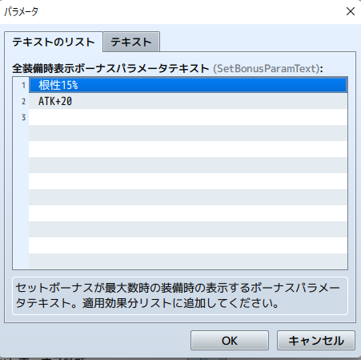
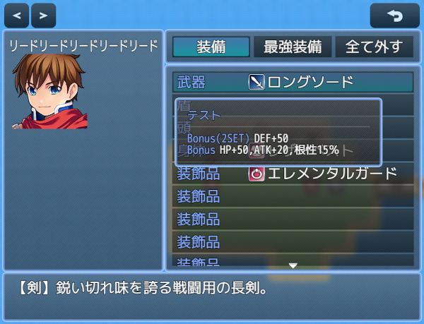

# [装備セットボーナス](https://raw.githubusercontent.com/nuun888/MZ/master/NUUN_SetBonusEquip.js)
# Ver.1.3.5
[ダウンロード](https://raw.githubusercontent.com/nuun888/MZ/master/NUUN_SetBonusEquip.js)  
#### 無償ライセンス
クレジット表記：任意  
商業利用：可能  
成人向け：可能  
改変：可能  
再配布：可能  
当リポジトリ内、公式フォーラム、正規販売サイト以外からのダウンロード、改変済みの場合はサポートは対象外となります。  
#### 必須、前提プラグイン
[共通処理](https://github.com/nuun888/MZ/blob/master/README/Base.md)  
#### 拡張プラグイン
[セットボーナスツールチップウィンドウ](https://github.com/nuun888/MZ/blob/master/README/SetBonusWindow.md)  

特定の装備と同時に装備したときにセットボーナスを発動させます。  
該当する全ての装備を装備している時に効果が適用されます。  

セットボーナスの設定からセットボーナスを設定してください。  
武器、防具にセットボーナスのタグを指定してください。  

同じセットボーナスIDは１つしか適用されません。  

## 設定方法
### セットボーナスの設定
適用するセットボーナスのパラメータはデータベースの武器または防具でセットボーナス用のデータを作成します。  
武器、防具両方で設定した場合は、武器で設定したデータが優先されます。武器IDが0の場合は防具が適用されます。  

プラグインパラメータのセットボーナス設定からセットボーナスを設定します。    
#### セットボーナス装備設定で適用させる装備を設定  
セットボーナス装備設定でこのIDのボーナスを適用する装備を指定します。この場合、指定した装備が装備され、条件を満たしていれば適用になります。  
指定した全ての装備アイテムのメモ欄にSetBonusのタグを記入してください。  

#### セットボーナス装備設定が空白  
SetBonusタグがある装備が装備されており、条件を満たしていれば適用されます。  

武器、防具のメモ欄  
`<SetBonus:[id], [id]...>` セットボーナスを適用します。  
`[id]`:セットボーナス設定のリスト番号またはセットボーナス名称  
同一IDのセットボーナスがボーナス適用数分装備していればセットボーナスが適用されます。  
一つの装備に複数のセットボーナスを指定できます。  

### 部分セットボーナス
該当する装備のセット数が条件を満たしていれば適用するセットボーナスを設定できます。  
セットボーナスが必要な装備が４つなら、そのうち2つ以上、3つ以上なら適用するボーナスをそれぞれ設定できます。  
適用するパラメータ用の武器、防具は別々に指定します。  

### その他
セットボーナス表示設定  
表示テキスト及び表示ボーナスパラメータテキストは別途NUUN_SetBonusWindow及びNUUN_EquipStatusEXが必要となります。  
表示テキスト例:BONUS(2SET)  
表示ボーナスパラメータテキスト例：身代わり30％。リストに複数設定できます。  

部分セットボーナスの表示テキストを設定する場合は、部分ボーナス装備数設定の各セットボーナスのセットボーナス表示設定で設定します。  
  

  

### 競合
NRP_TraitsPlusへの特徴適用  
[NRP_TraitsPlus能力値特徴適用](https://github.com/nuun888/MZ/blob/master/README/TraitsPlusNuunTraitObjects.md)  

## 更新履歴
2023/3/18 Ver.1.3.5  
無効なIDを指定したときに処理しないように修正。  
2022/11/17 Ver.1.3.4  
セットボーナスの表示パラメータテキストの仕様を変更。(要再設定)  
2022/11/15 Ver.1.3.3  
重複しない装備が武器、防具を区別せずに参照していた問題を修正。  
2022/11/14 Ver.1.3.2  
部分セットボーナスが正常に適用されていなかった問題を修正。  
日本語以外での表示を英語表示に変更。  
2022/10/8 Ver.1.3.1  
セットボーナスの設定を武器、防具のメモタグからのみ設定できるように修正。  
処理の最適化。  
2022/9/23 Ver.1.3.0  
指定のセットボーナスが適用済みか判定する機能を追加。  
2022/7/7 Ver.1.2.0  
ツールチップウィンドウ表示のための処理、プラグインパラメータ追加。  
2022/2/4 Ver.1.1.2  
処理の修正。  
2022/1/28 Ver.1.1.1  
セットボーナスを設定するパラメータを武器以外に防具からでも適用できるように変更。  
追加ボーナスの武器設定のパラメータ名が不自然だったのを修正。(要再設定)  
2022/1/27 Ver.1.1.0  
一定装備数によって発動する機能を追加。  
2022/1/22 Ver.1.0.0  
初版  
