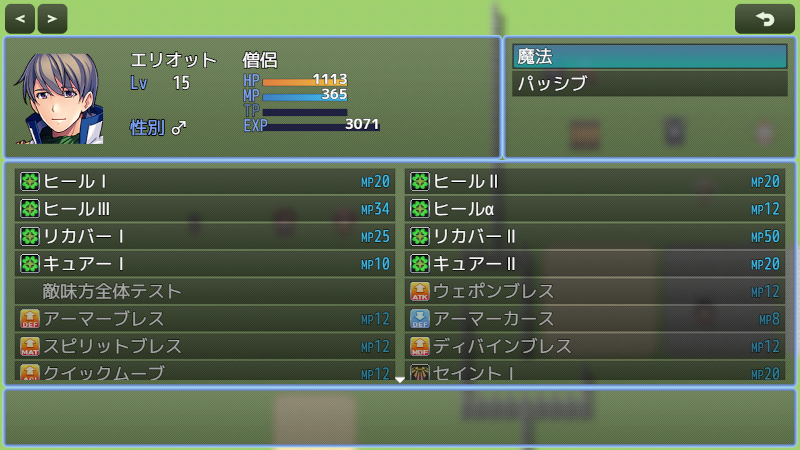

# [スキルステータス画面表示カスタマイズ](https://raw.githubusercontent.com/nuun888/MZ/master/NUUN_SkillStatusEX.js)
# Ver.2.0.0
[ダウンロード](https://github.com/nuun888/MZ/blob/master/oldVer/NUUN_SkillStatusEX.js)
#### 必須プラグイン
[共通処理](https://github.com/nuun888/MZ/blob/master/README/Base.md)  
[メニュー画面](https://github.com/nuun888/MZ/blob/master/README/MenuScreen_default.md)Ver.2.0.17以降  

スキル選択時のステータスウィンドウのレイアウトを変更します。  
このプラグインはメニュー画面プラグイン(Ver.2.0.17以降)が必要になります。  

  

### 設定
表示ステータス、独自ゲージの取得パラメータ  
`actor`:アクターのゲームデータ  

ステートの評価式には表示したいステートを指定できます。(直接記入)  
表示したいステートIDを,区切りで指定します。  
例 "1,5,11" 必ず''または""で囲む  
"1-10" ステートID1～10番まで表示  
"3-11,15"ステートID3～11,15番を表示  

### 画像
評価式or文字列(javaScript)には表示条件をjavascriptで記入します。条件が一致しているときに表示されます。  
無記入の場合は常に表示されます。  
actor:アクターゲームデータ  
actor.actor():アクターシステムデータ  

### ゲージ設定  
ゲージカラー(左)ゲージカラー(右)はHP、MP、TPに関しては、テキストタブで-1を指定することでデフォルトのカラーインデックスが設定されます。  
#### 独自ゲージ  
現在値：評価式で設定  
最大値：最大値評価式で設定  
ゲージ横幅：項目、ゲージ横幅で設定  
ゲージの識別IDは必ず設定してください。IDは任意の文字列を入力します。重複しないよう注意してください。  

### フォント変更
別途フォントを変更できるプラグインが必要です。(トリアコンタン様のFontLoad(フォントロードプラグイン)推奨)  

メニュー画面旧版用
[ダウンロード](https://github.com/nuun888/MZ/blob/master/oldVer/NUUN_SkillStatusEX.js)  

## 更新履歴
2024/1/8 Ver.2.0.0  
メニュー画面Ver.3.0.0更新による修正。  
2023/5/14 Ver.1.0.0  
初版  
