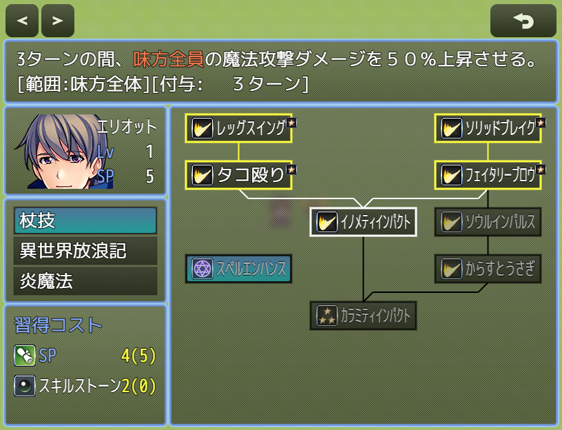

# [スキルツリー](https://raw.githubusercontent.com/nuun888/MZ/master/NUUN_SkillTree.js)
# Ver.1.3.0
[ダウンロード](https://raw.githubusercontent.com/nuun888/MZ/master/NUUN_SkillTree.js)
#### 無償ライセンス
クレジット表記：任意  
商業利用：可能  
成人向け：可能  
改変：可能  
再配布：可能  
当リポジトリ内、公式フォーラム、正規販売サイト以外からのダウンロード、改変済みの場合はサポートは対象外となります。  
#### 必須、前提プラグイン
[共通処理](https://github.com/nuun888/MZ/blob/master/README/Base.md)  

#### オプション
[スキルツリーステータス画面カスタマイズ](https://raw.githubusercontent.com/nuun888/MZ/master/NUUN_SkillTreeStausWindowEx.js)  

ツリー型のスキル習得システムを実装します。  

    

## 設定
プラグインパラメータのスキルツリー設定でスキルリストの設定を行います。識別名は必ず記入して下さい。  

アクター、クラススキルツリー設定でアクター、職業によって表示されるスキルタイプを指定します。  
スキルツリーID設定はスキルツリー設定のリストIDまたは識別名を指定し表示されるスキルツリータイプを設定してください。  
※プラグインコマンドのスキルツリータイプ追加でスキルツリータイプを追加できます。  

#### スキルツリーリストの設定
スキルツリー設定のスキル設定でスキルを指定します。  
設定したスキルが派生スキルで選択されていない場合は、自動的に起点スキルになります。  
設定したスキルはウィンドウの左側から派生スキルを元に順に位置が算出されます。既に表示されている座標に後から同じ座標に設定されている場合は、右側にずれて表示されます。  
派生スキルの終端スキルは設定しなくても問題ありませんが、座標やコスト等を設定する場合は追加する必要があります。  

#### コストの設定
各スキルコスト(消費数)には評価式が設定可能です。  
各コストの必要ポイント(個数)が1以上の場合はコストウィンドウに必要なコストが表示されます。  
消費数が0の場合は表示されません。スキルポイント消費のみプラグインパラメータで消費なし時の表示府表示が設定できます。  
スキルのメモ欄にコストの記入がある場合、プラグインパラメータの設定ではなくメモ欄の設定が適用されます。  

#### 職業変更時のスキルツリー
現在クラススキルツリー表示をONにしている場合、特定のクラスでのみ有効なスキルツリーは設定できなくなります。  
クラス変更時スキルリセットをONにすることで、職業変更時に変更前の職業で適用されるスキルツリーのスキルが全てリセットされスキルポイントが返還されます。  
なお、別の同じIDのスキルツリーが有効になっている場合はスキルツリーはリセットされません。  

#### その他多設定
アクター、職業のメモ欄  
`<LevelupSkillPoint:[sp]>` レベルアップ時に指定のスキルポイントを得ます。記入がない場合はプラグインパラメータの設定が適用されます。  
`[sp]`:スキルポイント  

`<InitSkillPoint:[sp]>` 初期のスキルポイントを指定します。記入がない場合はプラグインパラメータの設定が適用されます。  
`[sp]`:スキルポイント  

アイテム、スキルのメモ欄  
`<GainSkillPoint:[sp]>` 指定のスキルポイントを増減させます。  
`[sp]`:スキルポイント  

`<SkillTreeReset>` スキルポイントを全てリセットします。  

スキルのメモ欄  
`<SKillPointCost:[cost]>` 消費するスキルポイントを指定します。記入がない場合はプラグインパラメータの設定が適用されます。  
`[cost]`:スキルポイント  

`<SkillTreeItemCost:[Id],[num]>` 消費するアイテムを指定します。記入がない場合はプラグインパラメータの設定が適用されます。  
`[id]`:アイテムID  
`[num]`:消費アイテム個数  

`<SkillTreeItemWeapon:[Id],[num]>` 消費する武器を指定します。記入がない場合はプラグインパラメータの設定が適用されます。  
`[id]`:武器ID  
`[num]`:消費武器個数  

`<SkillTreeArmorCost:[Id],[num]>` 消費する防具を指定します。記入がない場合はプラグインパラメータの設定が適用されます。  
`[id]`:防具ID  
`[num]`:消費防具個数  

`<SkillTreeGoldCost:[cost]>` 消費する金額を指定します。記入がない場合はプラグインパラメータの設定が適用されます。  
`[cost]`:消費金額  

`<SkillTreeVariablesCost:[Id],[num]>` 消費する防具を指定します。記入がない場合はプラグインパラメータの設定が適用されます。  
`[id]`:ゲーム変数ID  
`[num]`:消費数  

`<SKillTreeImageImdex:[index]>` スプライトシートのインデックス番号を指定します。記入がない場合はプラグインパラメータの設定が適用されます。  
`[index]`:インデックス番号  

`<SkillTreeSkillText:[text]>`ヘルプウィンドウの説明文を設定します。記入がない場合はデータベース設定の説明が表示されます。  
`[text]`:説明文(制御文字使用可能)  

`<SkillTreeNoCostReturn>`このスキルのスキルコストの返還が行われません。  

アイテム、武器、防具のメモ欄  
`<SkillTreeCostNoReturn>` リセット時にアイテムの返還はありません。  

敵キャラのメモ欄  
`<DropSkillPoint:[sp], [rate]>` スキルポイントをドロップします。  
`[sp]`:スキルポイント  
`[rate]`:確率  

#### 評価式(全共通)  
`d`:スキルツリーデータ  
`v`:ゲーム変数　v[id]で指定。[]は付ける。  
`s`:スイッチ　s[id]で指定。[]は付ける。  
`skillId`:スキルID  
`count`:スキルの習得回数  
`maxCount`:スキルの最大習得回数  
`actor`:ゲームアクター  

#### 取得できるパラメータ
$gameActors  
`actor.nsp`:スキルポイント  
`actor.getSkillTreeCount(skillId)`:対象のスキルの習得回数  
`actor.isSkillTreeLearned(skillId)`:対象のスキルが習得済みか  
`actor.totalSp`:獲得した総スキルポイント  

#### 横方向に表示を拡大
プラグインパラメータのウィンドウ内幅をウィンドウサイズ以上に設定することで、横方向にスクロールできるようになります。  
数値を0にした場合はウィンドウ幅になります。  

## スキルツリーステータス画面カスタマイズ 
### 無償ライセンス
クレジット表記：任意  
商業利用：可能  
成人向け：可能  
改変：可能  
再配布：可能  
当リポジトリ内、公式フォーラム、正規販売サイト以外からのダウンロード、改変済みの場合はサポートは対象外となります。  
  
#### 必須プラグイン
[ステータス項目ベースプラグイン](https://github.com/nuun888/MZ/blob/master/README/NUUN_MenuParamListBase.md)  

スキルツリーステータスウィンドウの表示するアクターステータスをカスタイマイズ、ステータスウィンドウ、スキルツリーウィンドウ、スキルシーン内のいずれかにアクター画像を表示します。  
ダウンロード  
[スキルツリーステータス画面カスタマイズ](https://raw.githubusercontent.com/nuun888/MZ/master/NUUN_SkillTreeStausWindowEx.js)  

#### 更新履歴
2025/8/15 Ver.1.0.0  
初版  

## 拡張スキル習得
### 無償ライセンス
クレジット表記：任意  
商業利用：可能  
成人向け：可能  
改変：可能  
再配布：可能  
当リポジトリ内、公式フォーラム、正規販売サイト以外からのダウンロード、改変済みの場合はサポートは対象外となります。  
  
習得回数に応じて習得するスキルに対し別のスキルを習得させたりできます。  
ダウンロード  
[拡張スキル習得](https://raw.githubusercontent.com/nuun888/MZ/master/NUUN_SkillTreeLearnEx.js)  

#### 更新履歴
2025/9/6 Ver.1.0.1  
条件設定を行えるように修正。  
条件テキストを設定できるように修正。  
2025/8/26 Ver.1.0.0  
初版  

## 仕様 
Ver.1.0.4での更新によりスキル習得後の処理方法を変更した関係で、Ver.1.0.3以前とのセーブデータの互換性はありません。  
スキルツリータイプのアイコン表示は外部プラグインで表示させてください。スキルツリータイプの表示はコマンドタイプです。  
### Ver.1.2.1にアップデート後の一部ウィンドウのY座標について。  
ヘルプウィンドウの座標に仕様変更を行ったためスキルツリータイプ、スキルツリー、スキルツリーコスト、スキルツリーステータスウィンドウのY座標が96px下に下がります。  
そのため該当のウィンドウのY座標を96差し引き又は、ヘルプウィンドウ座標考慮無効をONにしてください。  

既知の問題

## クラス
`Scene_SkillTree` スキルツリーシーン  
`Window_SkillTreeType` スキルツリータイプウィンドウ  
`Window_SkillTree` スキルツリーウィンドウ  
`Window_SkillTreeCost` スキルツリーコストウィンドウ  
`Window_SkillTreeStatus` スキルツリーステータスウィンドウ  
`Window_SkillTreeConfirmation` 習得確認ウィンドウ  
`Window_SkillTreeConfirmation` 習得確認ウィンドウ  
`Window_SkillTreeHelp` スキルツリーヘルプウィンドウ  
`Window_SkillTreeTooltips` スキルツリーツールチップウィンドウ  

## 更新履歴
2025/9/24 Ver.1.3.0  
ヘルプウィンドウの説明文にデータベースとは別の任意の説明文を設定できる機能を追加。  
クラス毎のスキルポイントを設定できる機能を追加。  
スキルコスト返還を無効になるスキルを設定できる機能を追加。  
2025/9/23 Ver.1.2.13  
スキルツリータイプウィンドウの横幅がUIエリア最大まで表示されない問題を修正。  
2025/9/18 Ver.1.2.12  
スクロール処理を修正。  
2025/9/17 Ver.1.2.11  
クラス変更時にスキルポイントをリセットする機能を追加。  
クラス変更時にスキルポイントが加算されてしまう問題を修正。  
習得するスキルで習得されたスキルはリセットの対象外になるように修正。  
プラグインコマンド「スキル習得」にコスト、条件無視を追加。  
2025/9/15 Ver.1.2.10  
スキルツリーウインドウの項目の横幅を指定できる機能を追加。  
スキルツリーウィンドウからスキルツリータイプウィンドウに戻る際に、スキルコスト情報を表示しないように修正。  
2025/9/14 Ver.1.2.9  
スキル項目のアイコン、文字の位置を調整する機能を追加。  
スキルポイント増減アイテム、リセットアイテムでアクターを選択できない問題を修正。  
複数回習得でスキルポイントが全て返還されていなかった問題を修正。  
2025/9/13 Ver.1.2.8  
横余白の修正。  
2025/9/12 Ver.1.2.7  
習得条件にレベルを数値で設定できる機能を追加。  
スキルツリー習得以外でスキルを習得した際に、習得カウント回数が0になっていた問題を修正。  
一部の処理を変更。  
2025/9/10 Ver.1.2.6  
コスト表示の武器、防具の所持数が正常に表示されていなかった問題を修正。  
2025/9/8 Ver.1.2.5  
スキル削除時にコストの返還を有効にしている場合、エラーが出る問題を修正。  
アイテム、武器、防具のコストが支払われていなかった問題を修正。  
2025/9/7 Ver.1.2.4  
スキルコストウィンドウのスキル名でシークレット状態のスキル名が表示されてしまう問題を修正。  
シークレット表示の項目に対して、数値テキストを表示しないように修正。  
確認ウィンドウを表示に設定しているときに、スキルツリーを開くとエラーが出る問題を修正。  
2025/9/6 Ver.1.2.3  
フレーム枠を無効にしても表示されてしまう問題を修正。  
2025/9/6 Ver.1.2.2  
スキルが習得済みの場合は、習得済みと表示するように修正。  
スキルが習得済みの場合は、スキルコスト、条件を表示させない機能を追加。  
最大習得回数が0のスキルでも習得回数をカウントするように修正。  
習得確認ウィンドウを中央に表示させる機能を追加。  
2025/9/1 Ver.1.2.1  
初期の座標設定を修正。  
特定のプラグインでヘルプウィンドウの位置が下にずれて表示される問題を修正。  
ヘルプを下側に表示できる機能を追加。  
ヘルプ座標の考慮を無効にする機能を追加。  
skillIdでスキルIDを参照できない問題を修正。  
2025/8/31 Ver.1.2.0  
内幅を指定できる機能を追加。  
スキルツリーウィンドウのスキル項目に任意の数字テキストを設定できる機能を追加。  
列指定した項目がずれて表示される問題を修正。  
2025/8/30 Ver.1.1.2  
プラグインコマンドのスキル習得の習得対象を現在適用されているスキルツリータイプに修正。  
プラグインコマンドのスキル習得に前提スキル無視及びスキルの習得回数を指定できる機能を追加。  
プラグインコマンドにスキルの削除を追加。  
2025/8/28 Ver.1.1.1  
再習得可能なスキルの枠の色を指定できる機能を追加。  
コスト条件に習得条件のテキストを設定できる機能を追加。  
2025/8/26 Ver.1.1.0  
スキル習得コストの返還をアイテム、武器、防具、金額、変数にも適用。  
スキルツリー消去、スキルツリーリセットでスキル習得コストを返還されない設定を追加。  
スキルがスキルツリーで習得済みか判定するプラグインコマンドを追加。  
拡張スキル習得プラグインに対応するための更新。  
2025/8/25 Ver.1.0.6  
アクター、職業から初期スキルポイントを設定した場合に、スキルポイント増減時にエラーが起きる問題を修正。  
2025/8/24 Ver.1.0.5  
初期スキルポイント、レベルアップ時の獲得スキルポイントの個別設定を職業にも適用。  
起点スキルで列指定がないスキルが設定されている場合、一部の他起点スキルが表示されなくなる問題を修正。  
X座標を強制的に指定の位置に表示させる機能を追加。  
2025/8/23 Ver.1.0.4  
スキル習得後の処理の仕様を変更。(全バージョンとのセーブの互換性なし)  
プラグインコマンドのスキル習得を実行した際に、習得最大回数を超えて実行できてしまう問題を修正。  
派生元のスキルが未習得の場合、線の色を習得条件未達成の色で表示するように修正。  
2025/8/18 Ver.1.0.3  
消費スキルポイントコストが0の時でもコストを表示する機能を追加。  
レベルアップ時に獲得SPを表示するように修正。  
導入後にスキルポイントを増減させるとエラーが出る問題を修正。  
戦闘終了時にエラーが出る問題を修正。  
2025/8/17 Ver.1.0.2  
ロードしたデータでスキルツリーでスキルを習得しようとした場合にエラーが出る問題を修正。  
コストに評価式で設定できるように修正。  
習得条件を満たしているにもかかわらず、スキル項目が選択不能状態になる問題を修正。  
2025/8/15 Ver.1.0.1  
スキルツリーステータス画面カスタマイズに関する更新。  
2025/8/14 Ver.1.0.0  
初版  
