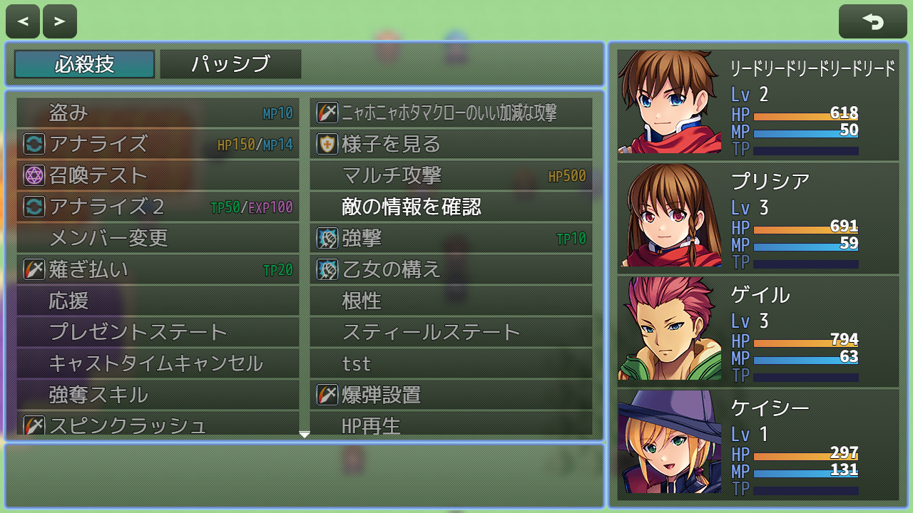

# [スキルウィンドウカスタマイズ](https://raw.githubusercontent.com/nuun888/MZ/master/NUUN_SkillWindowEx.js)
# Ver 公開準備中
通常版  
[通常版ダウンロード](https://raw.githubusercontent.com/nuun888/MZ/master/NUUN_SkillWindowEx.js)  
アクターステータス、アイテム項目のプリセットあり(７２０P)Ver.1.1.1  
[preset版ダウンロード](https://raw.githubusercontent.com/nuun888/MZ/master/pre/NUUN_SkillWindowEx.js)  
#### 必須プラグイン
[共通処理](https://github.com/nuun888/MZ/blob/master/README/Base.md)  
[ステータス項目ベースプラグイン](https://github.com/nuun888/MZ/blob/master/README/NUUN_MenuParamListBase.md)Ver.1.1.0以降  
#### 対応プラグイン
[立ち絵、顔グラ表示](https://github.com/nuun888/MZ/blob/master/README/ActorPicture.md)Ver.1.7.2以降  

アイテム画面をカスタマイズできます。  
戦闘中のアイテム画面には対応しておりません。 

## 主な機能
スキル画面のウィンドウの配置を自由に設定できます。  
スキル画面表示中にアクターウィンドウを常時表示させることができます。  
アクターウィンドウのステータス項目設定が設定されていない場合は、メニュー画面と同じ表示になります。  

  
画像は設定例です。初期設定ではデフォルトと同じ表示になります。  

## クラスウィンドウ
`Window_SkillMenuActor` アクターステータス(アクターウィンドウのステータス項目設定が設定されている場合)  
`Window_SkillInfo` アイテムインフォ(未実装)  

## プリセットあり
720P用です。
プラグインパラメータを適用させてから最新版にアップでとしてください。  
  

## 更新履歴
