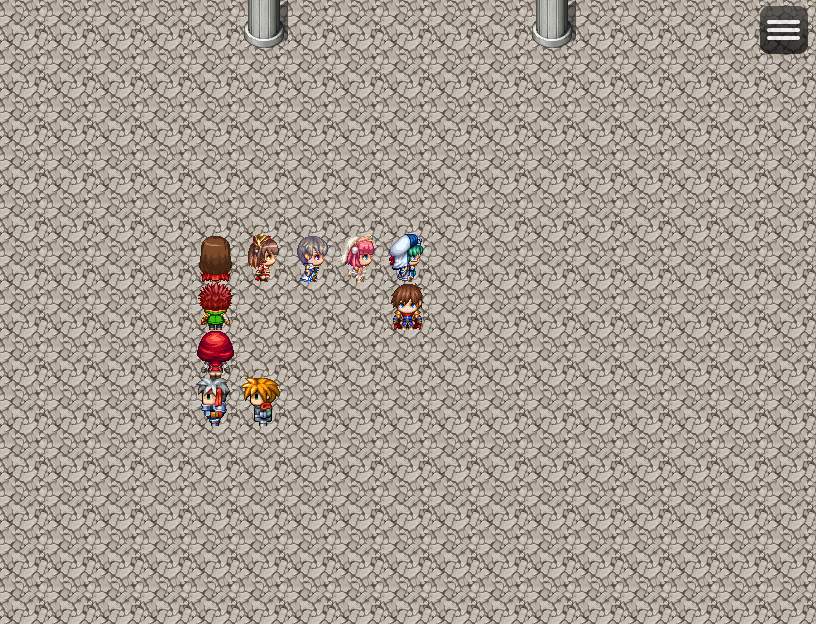

# [隊列控えメンバー表示](https://raw.githubusercontent.com/nuun888/MZ/master/NUUN_StandbyMemberFollowers.js)
# Ver.1.0.1
[ダウンロード](https://raw.githubusercontent.com/nuun888/MZ/master/NUUN_StandbyMemberFollowers.js)  

隊列に控えメンバーを表示します。  

  

仕様
隊列数を変更後にメンバーを元の隊列数以上加入すると、追加のフォロワーがどこからか現れて隊列にくっつきます。  

## 更新履歴
2022/12/5 Ver.1.0.1  
フォロワー衝突判定をスイッチでの判定に変更。  
全方向通行できなくなったときにONにするスイッチ及び、コモンイベントを呼び出す機能を追加。  
2022/12/4 Ver.1.0.0  
初版  
