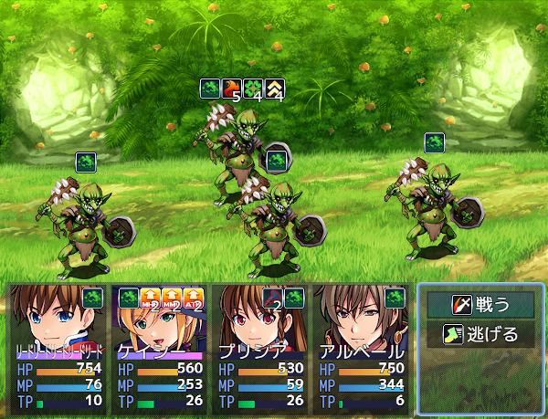

# [ステート横並び表示](https://raw.githubusercontent.com/nuun888/MZ/master/NUUN_StateIconSideBySide.js)
# Ver.1.5.8
[ダウンロード](https://raw.githubusercontent.com/nuun888/MZ/master/NUUN_StateIconSideBySide.js)

戦闘中に表示するステートを横並び表示にします。  
総ステート数が表示できる個数を超えた場合はアイコンが切り替わります。  
このプラグインには残りターンを表示する機能が備わっているため、ステート、バフ残りターン表示プラグインとの併用はできません。  

  

## 設定方法
#### 表示ターンモード  
'remaining'指定時のデフォルトの補正値は1です。  
'elapsed'指定時はターン数補正を-1に設定してください。  
経過ターンを表示させるには[ステート経過ターンカウント](https://github.com/nuun888/MZ/blob/master/README/StateTurnCount.md)プラグインが必要です。  

#### ターンの文字色
ステートのメモ欄  
`<BatState>`  このタグがあるステートは不利なステートになります。よって不利ステート、デバフターンの色が適用されます。  
上記タグがないステートは有利ステート、バフターンの色が適用されます。  

ステートアイコンの座標を変更するプラグインを使用している場合は、味方アイコン表示位置座標の設定をデフォルトにしてください。  

## 競合情報
MOG_BattleHudには対応しておりません。  

## 更新履歴
2024/11/9 Ver.1.5.8  
バトルスタイル拡張プラグイン併用時にステートターンが正常に表示されない問題を修正。  
2024/5/15 Ver.1.5.7    
ステートターンが表示されない問題を修正。  
2024/3/2 Ver.1.5.6  
バトルスタイル拡張プラグインでステートの表示を指定している場合に、ターンの表示がずれて表示されてしまう問題を修正。  
2024/1/3 Ver.1.5.5  
一部プラグインでの競合対応。  
2023/7/15 Ver.1.5.4  
アイコン画像のスムーススケールをON、OFFに出来る機能を追加。  
2022/3/30 Ver.1.5.3  
自動解除のタイミングがターン終了時の時にターン数が正常に表示されていなかった問題を修正。  
2022/12/6 Ver.1.5.2  
カラー指定のプラグインパラメータのTypeをcolorに変更。(コアスクリプトVer.1.6.0以降)  
アイコン指定のプラグインパラメータのTypeをiconに変更。(コアスクリプトVer.1.6.0以降)  
日本語以外での表示を英語表示に変更。  
2022/11/13 Ver.1.5.1  
ターンを表示しない場合、ステート、バフ付加時にエラーが出る問題を修正。  
2022/10/29 Ver.1.5.0  
ターン数に文字色を指定できる機能を追加。  
疑似3Dバトル併用時でステートにかかってないときのアイコンが表示されなくなる問題を修正。  
2022/10/15 Ver.1.4.0  
味方のステートが付与されていないときのアイコンを指定できる機能を追加。  
2022/8/22 Ver.1.3.2  
アイコンの表示位置とアイコンの表示揃えの設定を分割。  
2022/7/2 Ver.1.3.1  
メンバー交代後ステートアイコンが残ってしまう問題を修正。  
2022/4/9 Ver.1.3.0  
表示アイコンの行を指定できる機能を追加。  
処理の軽量化。  
2022/3/31 Ver.1.2.3  
疑似3Dバトルとの併用時にアクターのステートが表示されない問題を修正。  
2022/3/30 Ver.1.2.2  
ステートが表示できる個数を超えて付加されている時に画像が乱れる問題を修正。  
2022/3/28 Ver.1.2.1  
特定のプラグインにてアイコン表示部分に線のような画像が表示されてしまう問題を修正。  
2022/1/21 Ver.1.1.0  
ステートのターンの表示方法に経過ターンを追加。（要ステート経過ターンカウント）  
2021/9/23 Ver.1.1.0  
ステートの表示切り替え反映による処理の大幅変更。  
敵にも横並び表示に出来る機能を追加。  
2021/1/24 Ver.1.0.3  
バトルスタイル拡張併用時の処理を再度修正。  
2021/1/17 Ver.1.0.2  
バトルスタイル拡張プラグイン導入時、ステートの座標許可をtureにすると座標が反映されない問題を修正。  
バトルスタイル拡張プラグイン2.0.0以降対応。  
2021/1/3 Ver.1.0.1  
表示する横幅を指定できるように変更。  
2021/1/2 Ver.1.0.0  
初版  
