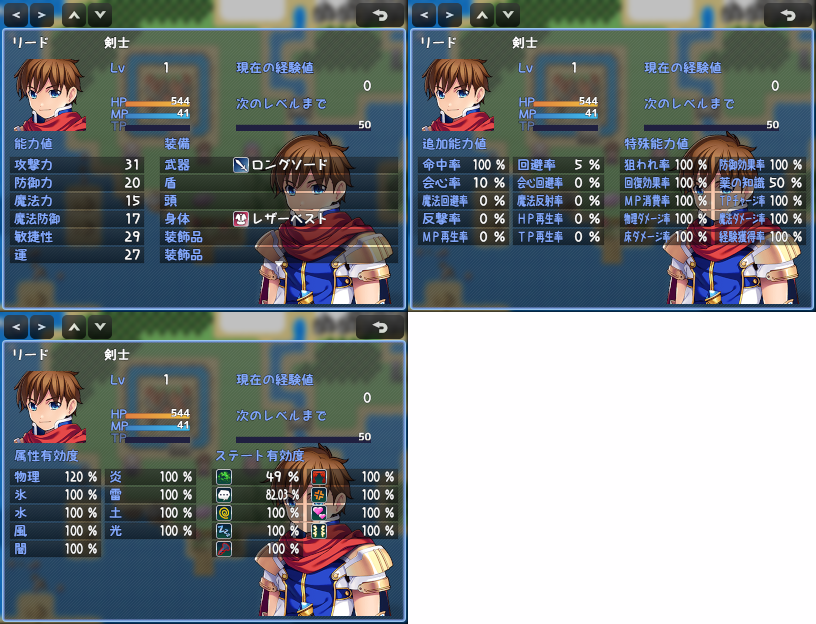

# [ステータス画面表示拡張](https://raw.githubusercontent.com/nuun888/MZ/master/NUUN_StatusScreen.js)
# Ver.2.6.9
[ダウンロード](https://raw.githubusercontent.com/nuun888/MZ/master/NUUN_StatusScreen.js)
#### 必須、前提プラグイン
[共通処理](https://github.com/nuun888/MZ/blob/master/README/Base.md)Ver.1.6.4以降  

ステータス画面を拡張します。  
各ページの表示するステータスの項目をカスタマイズできます。 

  

## 設定方法
#### 注意
Ver.2.4.6でレベルに横幅が指定できるようになりました関係で、レベルの項目横幅(8)に120を記入して下さい。  

### 各項目の設定
#### 名称
項目の名称を設定します。  
無記入の場合はデーターベース及びこのプラグイン内で設定した名称が表示されます。
#### 項目リスト
表示させたい項目を選択します。
#### 評価式or文字列
評価式を記入します。オリジナルパラメータでは必ず記入してください。  
能力値、追加能力値、特殊能力値、任意ステータスで有効ですが無記入の場合は任意ステータス以外は自動的に参照されます。  
actorclassは記述欄のみ指定します。  
`this._actor`または`actor` 表示中のアクターのゲームデータ
`dactor` 表示中のアクターのデータベース  
`aclass` 表示中のアクターの職業データ  

共通画像、個別画像
評価式or文字列(javaScript)には表示条件をjavascriptで記入します。条件が一致しているときに表示されます。  
無記入の場合は常に表示されます。  
`actor`:アクターゲームデータ  
`dactor`:アクターシステムデータ  
`aclass` 表示中のアクターの職業データ  

##### ステート耐性  
`rate` ステート有効度  
##### ステート耐性、属性耐性
`r` 属性、ステート耐性値　全ての耐性値を乗算した数値  
##### ステート(アイコン表示)
表示したいステートIDを指定できます。(直接記入)  
表示したいステートIDを,区切りで指定します。  
例 "1,5,11" 必ず''または""で囲む  
"1-10" ステートID1～10番まで表示  
"3-11,15"ステートID3～11,15番を表示  

#### システム項目文字色
項目の「名称」の文字色を指定します。テキストタブでカラーコードが入力できます。
#### X表示列位置
表示させる列を指定します。
#### Y表示行位置
表示させる行を指定します。
#### X座標
X座標を指定します。X表示列位置からの相対座標になります。
#### Y座標
Y座標を指定します。Y表示列位置からの相対座標になります。
#### 項目横幅
項目の横幅を指定します。
#### システム項目横幅
「名称」の横幅を指定します。
#### ワイド表示モード
項目の表示を２列表示または３列表示に表示させます。
#### コンテンツ背景表示
項目の背景を表示します。
#### 記述欄設定
記述欄でタグ指定するためのタグを設定します。「記述欄タグ名」に任意の文字列を記入してください。一部文字列は使用できない場合もあります。   
制御文字が使用可能です。  
評価式or文字列でactorclassを選択することで職業のメモ欄から参照されます。指定しない場合はアクターのメモ欄から参照されます。  
アクターまたは職業のメモ欄  
`<[tag]:[text]>` 記述欄のテキスト  
`[tag]`:タグ名  
`[text]`:表示するテキスト。  
改行すれば何行でも表示可能ですので、独自の項目を追加することも可能です。  
`<desc1:ああああ>` desc1とタグ付けされた項目に「ああああ」が表示されます。  
文章を表示させる場合は`<desc1:ああああ>`と記入してください。  
#### 小数点桁数
小数点の桁数を指定します。
#### 単位
接尾につける単位を設定します。
#### 開始インデックス
装備欄の開始インデックスを指定します。
#### 表示装備数
装備欄の表示を指定します。(0で制限なし)

## 設定方法
### 立ち絵設定
このプラグインではアクターの立ち絵の表示ができます。  
このプラグインは立ち絵、顔グラ表示EX対応です。  
立ち絵、顔グラ表示EXで設定した立ち絵の座標設定は立ち絵表示EX用画像設定で設定します。  
なお設定をしなくても表示は可能です。  
立ち絵、顔グラ表示EXを使用しない場合は画像設定で立ち絵を設定してください。  

APNGを表示するには別途ApngPicture.js(トリアコンタン様)が必要です。  

### 背景設定

### レーダーチャート設定

### 特定のアクター又は職業の表示させる装備を指定
アクター又は職業のメモ欄  
`<StatusShowEquips:[name],[name]...>`  
`[name]`:装備部位名  
指定した装備部位のみ表示されます。指定がない場合は全ての部位が表示されます。  
アクターと職業両方に記入した場合はアクターの設定が優先されます。  

### ステータスにアクターまたは職業別に画像を表示する
アクター、職業のメモ欄  
`<[tag]:[Img]>` 個別画像を表示します。  
プラグインパラメータの個別指定画像フォルダで指定したフォルダ直下の画像名を拡張子なしで記入します。  
`[tag]`:タグ名(項目設定のタグ名(13)で記入したタグ)  
`[text]`:任意の個別画像。  

### 更新履歴
2024/4/7 Ver.2.6.9  
小数点の桁数が正常に機能していない問題を修正。  
2024/4/6 Ver.2.6.8  
封印装備非表示をOFFにしても適用されてしまう問題を修正。  
現在の経験値、次のレベルまでを１行で表示させる機能を追加。  
2024/2/3 Ver.2.6.7  
特徴で封印されている装備を表示させない機能を追加。(一部プラグインの競合対策)  
2024/1/8 Ver.2.6.6  
競合対策。  
2023/11/23 Ver.2.6.5  
職業、二つ名に色を指定できるように対応。  
2023/6/30 Ver.2.6.4  
装備スロット名がなしまたはデータが存在しない場合は表示しないように修正。  
2023/5/21 Ver.2.6.3  
共通画像、個別画像に表示条件を指定できる機能を追加。  
AvPort_dsWeaponMasteryと併用できるように対応。  
2023/5/4 Ver.2.6.2  
評価式に職業のデータを参照できるように修正。  
記述欄を職業から参照できるように修正。  
2023/3/15 Ver.2.6.1  
String入力のエラー防止処理を追加。(NUUN_Base Ver.1.6.4以降)  
2023/3/14 Ver.2.6.0  
任意の画像を表示できる機能を追加。  
ページ切り替えの処理を修正。  
2023/3/9 Ver.2.5.4  
レーダーチャートの色設定が正常に適用されていなかった問題を修正。  
システムカラー0番が指定できない問題を修正。  
2023/3/4 Ver.2.5.3  
ページ切り替えのキー設定を指定できる機能を追加。(別途キー割り当てが出来るプラグインが必要です)  
2023/2/28 Ver.2.5.2  
特定の装備部位のみ表示させる機能を追加。  
2023/2/25 Ver.2.5.1  
APNGに対応。  
2023/1/14 Ver.2.5.0
各項目(一部を除く)にアイコンを指定できる機能を追加。  
各項目(一部を除く)に文字揃えを指定できる機能を追加。  
サイドビューアクター表示に関する修正。  
次の経験値のY座標を修正。  
2022/12/15 Ver.2.4.6  
カラー指定のプラグインパラメータのTypeをcolorに変更。(Ver.1.6.0以降)  
アイコン指定のプラグインパラメータのTypeをiconに変更。(Ver.1.6.0以降)  
数値部分に数値フォントを指定できる機能を追加。  
2022/11/9 Ver.2.4.5  
フォントサイズがおかしくなる問題を修正。  
2022/11/3 Ver.2.4.4  
特定の場面でエラーが出る問題を修正。  
2022/9/23 Ver.2.4.3  
一部プラグインの競合対策。  
2022/8/22 Ver.2.4.2  
制御文字でフォントサイズ変更をした後に、項目のフォントのサイズが変化してしまう問題を修正。  
2022/7/26 Ver.2.4.1  
オリジナルパラメータの評価式が適用されていなかった問題を修正。  
2022/7/23 Ver.2.4.0  
評価式の仕様を変更。  
ステートのアイコンを表示したいステートのみ表示する機能を追加。  
バトルステータスに表示されるステートの表示をメニュー画面上に表示できる機能を追加。  
経験値の%表示時に小数点が指定した小数点数を無視して表示されてしまう問題を修正。  
2022/6/15 Ver.2.3.7  
評価式に文字列を記入したときにNaNと表示されてしまう問題を修正。  
2022/3/22 Ver.2.3.6  
属性、ステート耐性値の取得値を変更。  
2022/2/16 Ver.2.3.5  
パラメータ評価式を属性耐性にも適用。  
ステート耐性のアイコンをステータス用のアイコン画像にする機能を追加。  
2022/2/6 Ver.2.3.4  
ステート無効化の有効度の色を指定できる機能を追加。  
カラーコードに対応。要共通処理Ver.1.4.0以降（レーダーチャートを使用している場合はレーダーチャートベースを最新版にしてください）  
基本能力値に単位をつけられる機能を追加。  
2022/1/24 Ver.2.3.3  
フォントサイズを指定できる機能を追加。  
2022/1/9 Ver.2.3.2  
処理を一部修正。  
2021/12/11 Ver.2.3.1  
立ち絵、顔グラ表示EXで設定した勝利時の画像が戦闘終了後でも残ってしまう問題を修正。  
2021/12/11 Ver.2.3.0  
立ち絵表示EXに対応。  
2021/11/27 Ver.2.2.9  
オリジナルパラメータにも小数点を指定できるように変更。  
2021/11/26 Ver.2.2.8  
カラーコードに対応。  
一部の項目で名称が適用されない問題を修正。  
2021/11/7 Ver.2.2.7  
立ち絵の切り替え機能が機能していなかった問題を修正。  
2021/11/3 Ver.2.2.6  
最大HP、最大MPを表示できる機能を追加。  
2021/10/24 Ver.2.2.5  
最初に表示されるページを指定できる機能を追加。  
2021/9/19 Ver.2.2.4  
コアスクリプトVer.1.3.3による修正。  
2021/8/24 Ver.2.2.3  
旧バージョンにプラグインパラメータの最大最小設定に関する修正。  
2021/8/11 Ver.2.2.2  
パラメータの任意名称が取得できない問題を修正。  
アクターのデータベースデータが記載のパラメータで取得出来ていなかった問題を修正。  
2021/8/7 Ver.2.2.1  
ページ設定を初期設定のままステータス画面を開くとエラーが出る問題を修正。  
2021/8/4 Ver.2.2.0  
装備表示機能拡張。  
2021/7/19 Ver.2.1.1  
レーダーチャートの座標調整でマイナス側に設定できなかった問題を修正。  
2021/7/19 Ver.2.1.0  
属性耐性、ステート耐性をレーダーチャートで表示する機能を追加。  
ページ設定が正常に取得できていなかった問題を修正。  
2021/6/19 Ver.2.0.7  
メンバーが一人の時にアクター切り替えのボタンを表示させないように修正。  
2021/6/5 Ver.2.0.6  
サイドビューアクター画像で戦闘終了後にステータス画面を開くと戦闘勝利時のモーションが実行してしまう問題を修正。  
2021/5/28 Ver.2.0.5  
フロントビューでサイドビューアクターが表示されなかった問題を修正。  
キャラを切り替えた時にモーションが反映されない問題を修正。  
2021/5/24 Ver.2.0.4  
小数点表示を能力値にも対応。  
2021/5/23 Ver.2.0.3  
サイドビューアクターを表示させる機能を追加。  
2021/5/23 Ver.2.0.2  
キャラチップを表示させる機能を追加。  
任意ステータスで単位が二つ表示される問題及び、単位を設定しないと表示されない問題を修正。  
2021/5/22 Ver.2.0.1  
プラグインパラメータのページ設定の表示がおかしかった問題を修正。  
2021/5/20 Ver.2.0.0  
各項目を自由に設定、配置できるように変更。  
アクター立ち絵を変更する機能を追加。  
ウィンドウスキンを変更する機能を追加。  
2021/2/28 Ver.1.3.7  
「背景サイズをUIに合わせる」をfalseに設定時UIの左上基準に表示されてしまう問題を修正。  
2021/2/27 Ver.1.3.6  
ステート有効度のステート無効化が反映されていなかった問題を修正。  
2021/2/23 Ver.1.3.5  
プロフィール欄を表示させない機能を追加。  
2021/2/21 Ver.1.3.4  
追加パラメータ、特殊パラメータ、独自パラメータに任意の単位を付けられるように変更。  
2021/2/20 Ver.1.3.3  
追加パラメータ、特殊パラメータに任意のパラメータを追加できる機能を追加。  
2021/2/17 Ver.1.3.2  
アクター立ち絵の拡大率が100以外の時に画像X座標がずれいてた問題を修正。  
2021/2/16 Ver.1.3.1  
Scene_Base.prototype.isBottomButtonModeで設定を変更した際、ウィンドウがずれる問題を修正。  
アクター立ち絵の拡大率が100以外の時に画像座標が下基準になっていなかったのを修正。  
2021/1/24 Ver.1.3.0  
独自パラメータを表示できる機能を追加。  
2021/1/9 Ver.1.2.0  
各項目の設定方法を変更。  
2020/12/28 Ver.1.1.2  
立ち絵の座標処理を修正。  
2020/12/8 Ver.1.1.1  
最大レベル時の次のレベルまでの経験値表示のゲージMAXで100％で表示するように修正。  
2020/12/7 Ver.1.1.0  
次のレベルまでの経験値表示を百分率表示に出来るよう対応。  
2020/11/26 Ver.1.0.7  
特殊パラメータでSparamIdを3に設定し、SparamNameを空欄の状態でステータス画面を開くと本来「薬の知識」が出るところ「回復効果率」と表示されてしまう問題を修正。  
2020/11/23 Ver.1.0.6  
立ち絵を表示位置を左、中央、右から選択し配置出来る機能を追加。  
2020/11/22 Ver.1.0.5  
背景画像を指定できる機能を追加。  
2020/11/19 Ver.1.0.4  
解像度とUIのサイズが違う場合に、ステータス詳細項目がウィンドウ外にずれる問題や、他のステータス項目と表示が被る問題を修正。  
2020/11/18 Ver.1.0.3  
ステータス詳細項目が画面からはみ出た際、項目名が正常に表示されない問題を修正。  
一部処理を変更。  
2020/11/18 Ver.1.0.2  
表示外の少数点を四捨五入か切り捨てで丸める機能を追加。  
2020/11/17 Ver.1.0.1   
追加能力値、特殊能力値、属性有効度、ステート有効度の表示できる小数点の桁数を指定できる機能を追加。  
ページの切り替えをタッチ操作でも行えるように対応。  
2020/11/16 Ver.1.0.0  
初版  

