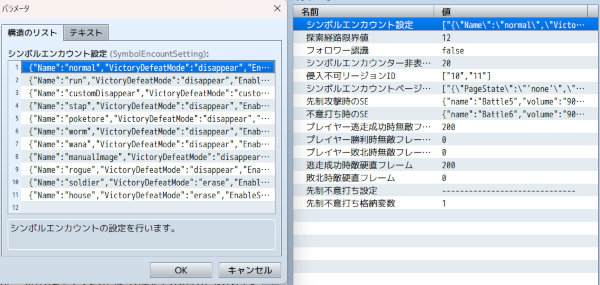
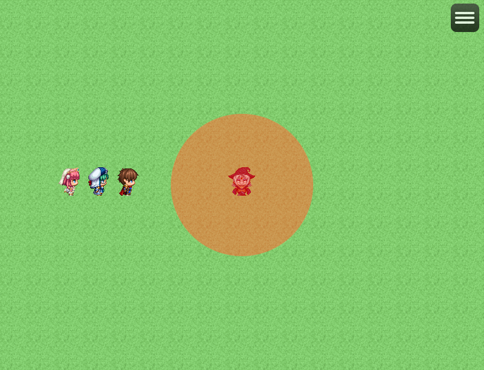
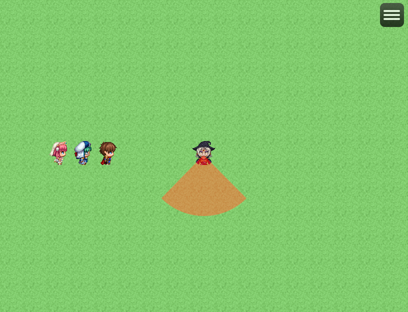
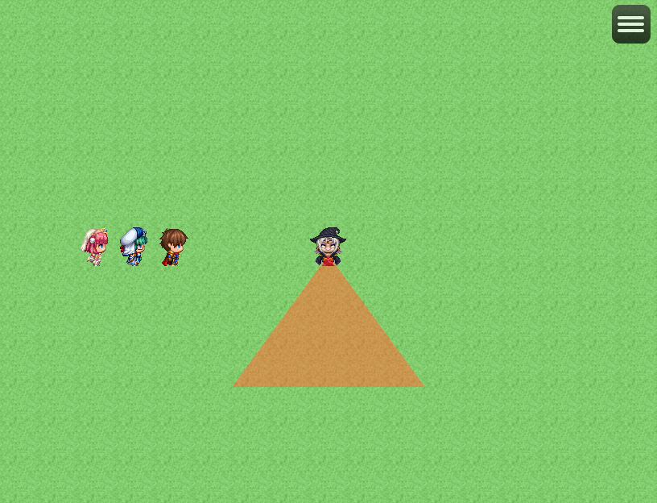
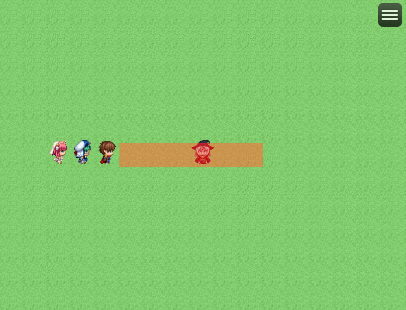
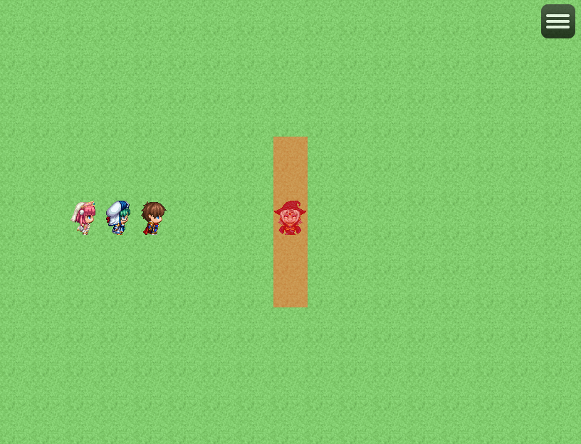
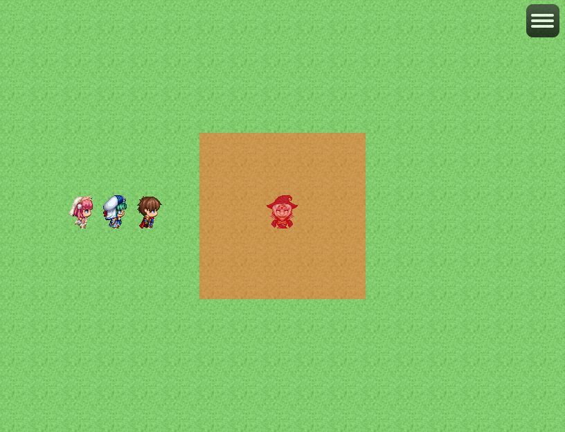
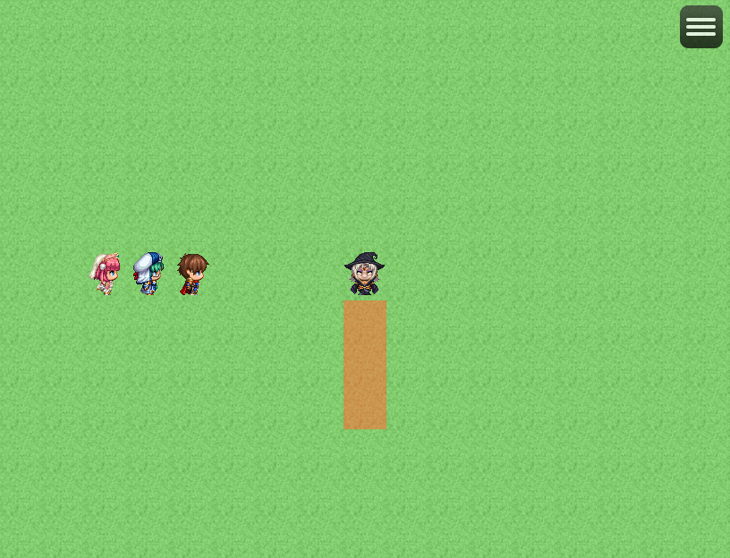
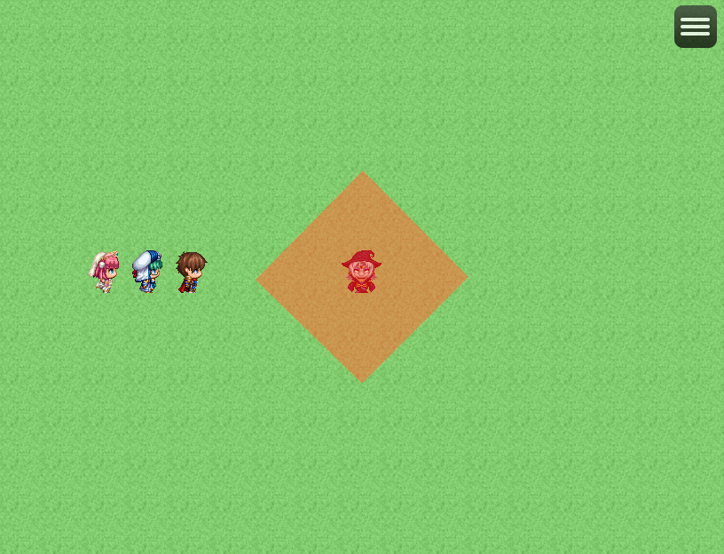

# シンボルエンカウント
## Ver.1.0.2
#### 必須、前提プラグイン
[共通処理](https://github.com/nuun888/MZ/blob/master/README/Base.md)  

シンボルエンカウントシステムを実装します。  
## 設定
イベントのメモ欄  
`<SymbolEncEnemy:[id]>` このタグがあるイベントはシンボルエンカウントとなります。  
`[id]`:シンボルエンカウント設定IDまたは識別名  

### イベントの各ページ設定
探索:自律移動指定可能、トリガー発動時のみイベント実行可能  
発見時:即イベント実行可能  
追跡:自律移動カスタム指定可能、トリガー発動時のみイベント実行可能  
退避:自律移動カスタム指定可能、トリガー発動時のみイベント実行可能  
イベント実行(旧戦闘):即イベント実行可能  
見失う:即イベント実行可能  
勝利:即イベント実行可能  
逃走成功:即イベント実行可能  
所定位置に戻る:自律移動カスタム指定可能、トリガー発動時のみイベント実行可能  
敗北:即イベント実行可能  

状態の移行は自動で行われますが、プラグインコマンドで指定の状態に移行できます。  
またシンボルエンカウント用のページ以外のイベントページの条件が一致している場合は、シンボルエンカウントとして認識されず通常のイベントとして実行されます。(Ver.1.0.1以降)  

### シンボルエンカウントの設定
プラグインパラメータのシンボルエンカウント設定でシンボルエンカウンターの設定を行います。  
   

#### 探索経路限界値
探索経路の最大値を指定します。  

#### 識別名
識別名は任意の名称を記入します。シンボルエンカウント設定ID指定に使用します。  

#### 勝利後シンボルエンカウンター処理
消滅:勝利後シンボルエンカウンターが消滅します。この消滅の場合プラグインコマンド「シンボルエンカウンター復活」でエンカウンターの再表示が可能です。  
イベントの消滅:勝利後シンボルエンカウンターが消滅します。プラグインコマンド「シンボルエンカウンター復活」でエンカウンターの再表示は行われません。マップ再進入時に復活します。  
カスタム:勝利ページの実行内容にユーザ独自に処理を設定します。  

#### 特定スイッチシンボルエンカウント有効化
特定のスイッチがシンボルな場合にエンカウンターとして実行します。OFF時に通常のイベントとして実行する場合はシンボルエンカウント用のページ以外に処理を記入します。  
ON時はシンボルエンカウント用のページ設定のみ条件判定されます。OFF時は通常のページ条件のみ判定されます。  

#### 全同一画像有効
シンボルエンカウントページの画像を１ページ目の画像で表示します。シンボルエンカウントページ以外は適用されません。  

#### トリガー自動設定
シンボルエンカウントページのトリガーを自動設定します。   
1:探索(イベントから接触)  
2:発見時(並列実行)  
3:追跡(イベントから接触)  
4:退避(イベントから接触)  
5:イベント実行(旧戦闘)(自動実行)  
6:見失う(並列実行)  
7:勝利(並列実行)  
8:逃走成功(並列実行)  
9:所定位置に戻る(イベントから接触)  
10:敗北(並列実行)  

#### 探索モード
探索しない:プレイヤーが視界に入っても検知を行いません。またトリガー時はプレイヤーの方向を向きます(通常の処理)。  
探索する:プレイヤーを検知した場合、Discoveryモードに移行します。トリガー時にプレイヤーの方向を向きません。

####  視認範囲の指定
##### circle
敵の認識範囲が円形になります。  
視認範囲範囲設定[接触範囲, 角度0°～360°]  
  
角度はイベントの正面からみた角度です。  
90°ならプレイヤー正面から左右45°  
  

##### triangle
敵の認識範囲が三角形になります。  
視認範囲範囲設定[正面からの接触範囲, 角度0°～180°]  
  

#### besideRange
指定した横方向の範囲内の接触判定を拡大します。向きは無視されます。  
視認範囲範囲設定[接触左側範囲(正の数の整数), 接触右側範囲(正の数の整数)]  
  

##### verticalRange
指定した縦方向の範囲内の接触判定を拡大します。向きは無視されます。  
視認範囲範囲設定[接触上側範囲(正の数の整数), 接触下側範囲(正の数の整数)]  
  

##### range
指定した範囲を中心に接触判定を拡大します。4と記入した場合はイベントを中心に±2マスの範囲(5マス)でトリガーが起動します。  
視認範囲範囲設定[接触横範囲(偶数の正の数の整数), 接触縦範囲(偶数の正の数の整数)]  
  

##### frontRange
指定したイベントからの真正面の範囲までの接触判定を拡大します。  
視認範囲範囲設定[接触範囲(正の数の整数)]  
  

##### rangeEX
イベントから指定した範囲内の接触判定を拡大します。  
視認範囲範囲設定[イベントの接触範囲点AX座標(整数),接触範囲点AY座標(整数),接触範囲点BX座標(整数),接触範囲点BY座標(整数),接触範囲点CX座標(整数),接触範囲点CY座標(整数),接触範囲点DX座標(整数),接触範囲点DY座標(整数)]  
接触判定をひし形にする。  
例:`<EventRange:rangeEX,0,-2,2,0,0,2,-2,0>`  
  

#### 反応モード
通常:範囲内のプレイヤーを検知します。  
無反応:範囲内にプレイヤーが侵入しても検知しません。  
ダッシュ時反応:ダッシュ時に範囲内のプレイヤーを検知します。 
移動時反応:移動時に範囲内のプレイヤーを検知します。 

#### プレイヤー探索範囲
プレイヤーがシンボルエンカウンターからの探索範囲を指定します。0で無制限になります。
指定の数値以上の距離が開いている場合は探索処理をスキップします。  

#### 移行モード
検知後移行するモードを指定します。  
追跡:プレイヤーを追いかけます。  
プレイヤーに近づく(プレイヤー固定):プレイヤーに向かって動き始めBattleモードに状態移行します。、その際にプレイヤーは動けなくなります。  
戦闘:Battleモードに状態移行します。  
なんとなく逃げる:プレイヤーから逃げげますが、、障害物に引っ掛かりやすいです。  
逃げる:プレイヤーから逃げげます。 
必死に逃げる:障害物をなるべく避けプレイヤーから逃げます。  

#### 追跡時スピード
プレイヤーを追跡するときの速度を指定します。イベント設定の最大値を超えて設定可能です。0でイベントページの設定になります。  

#### 逃走時時スピード
プレイヤーから逃げるときの速度を指定します。イベント設定の最大値を超えて設定可能です。0でイベントページの設定になります。  

#### 先制不意打ち有効
このシンボルの先制不意打ち有効を有効にします。なお、プラグインパラメータ「先制不意打ち格納変数」の値を1以上に設定してください。  

#### 特殊移動
イベントの自立移動をカスタムに設定。  
ルートのスクリプトに記入。  
`this.junpPlayerPosition([最大移動幅])` プレイヤー横にジャンプして移動します。  
[最大移動幅]:最大のジャンプ幅  
`this.junpPlayerPosition(6)` 最大のジャンプ幅が6マスになります。  

### シンボルエンカウントの視認率
パーティ能力のエンカウント率無効が有効の場合、シンボルエンカウンターから認識されなくなります。  
エンカウント率半減が有効の場合、シンボルエンカウンターからの視認範囲が半分になります。  
なおどちらも「視認率変動なし」を有効にしているエンカウンターには効果はありません。  
茂み視認率は茂み属性のあるタイルを通行している場合にシンボルエンカウンターの視認範囲が視認率分現象します。  

### 先制不意打ち
プラグインパラメータの「先制不意打ち格納変数」を1以上に設定することで有効になります。  
またエンカウントタイプ毎に先制不意打ちの有無を設定できます。  
イベント実行(旧戦闘)のイベントコマンドの「戦闘の処理」の前に「先制不意打ち格納変数」の変数に指定の値を代入することで先制攻撃または不意打ち攻撃を強制させることが出来ます。  
`0:通常 1:先制攻撃 2:不意打ち攻撃`  
また先制、不意打ち時のSEを設定できます。  
※戦闘の処理を実行しないと先制不意打ちのデータは初期化されませんので戦闘を行わない場合は、対象のエンカウントタイプの「先制不意打ち有効」をOFFに設定してください。  

### 今後のアップデート予定  
プラグインコマンドでのサーチ判定機能  
別のシンボルタイプへの移行  
ワープ移動  
特定条件での検知  
特定条件でのサーチ範囲設定  
先制不意打ちでの戦闘BGMの変更  

既知の不具合  

## 更新履歴
2025/10/20 Ver.1.0.2  
プラグインコマンドでイベントを指定した場合、ID番号がずれて指定していた問題を修正。  
プラグインコマンドでイベントを指定した場合、シンボルエンカウンターではない場合にエラーが出る問題を修正。  
シンボルエンカウント設定のリストID2の識別名をrunからrunSymbolに変更。  
2025/10/19 Ver.1.0.1  
通常イベントページの条件が有効なら適用できるように修正。  
2025/10/18 Ver.1.0.0  
初版  
