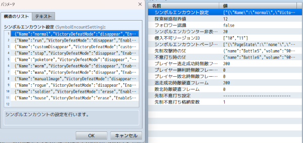
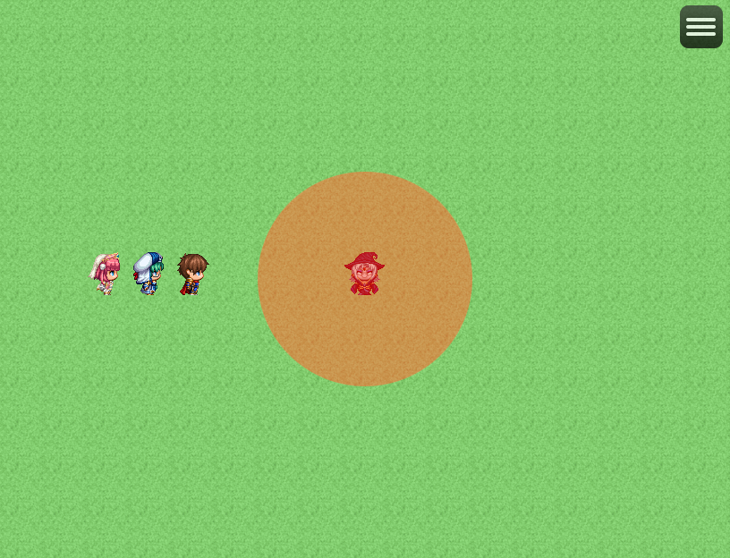
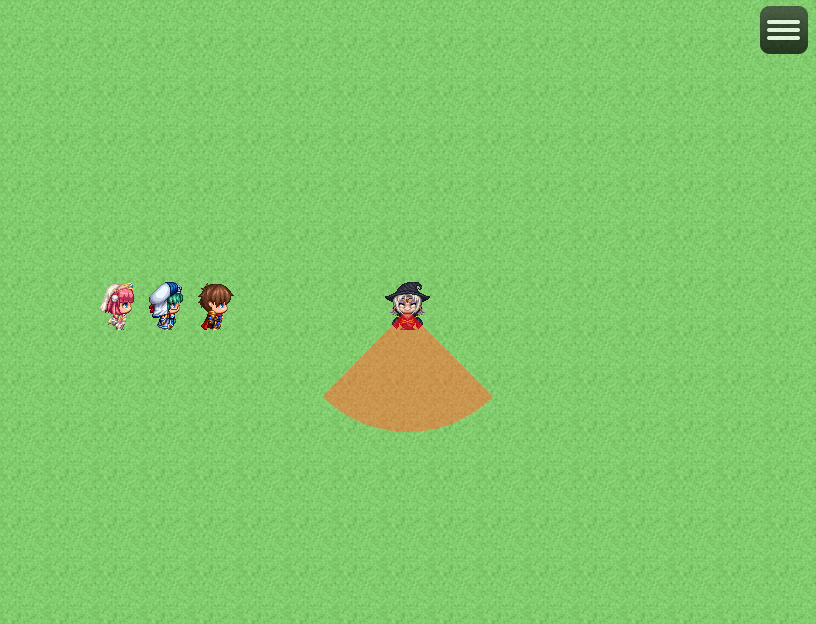
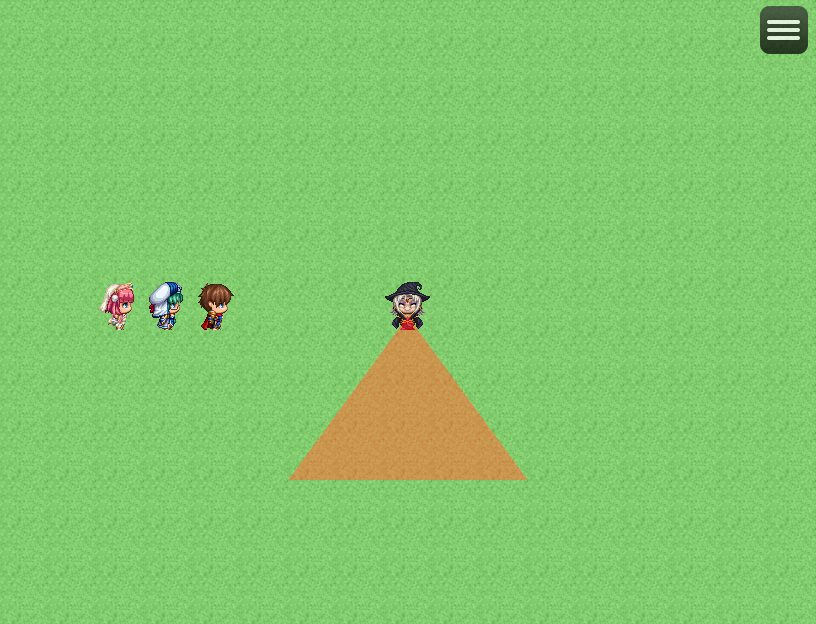
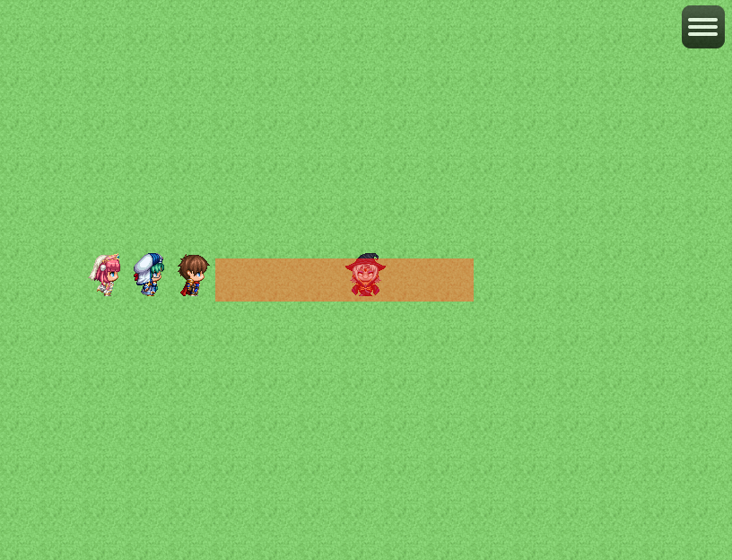
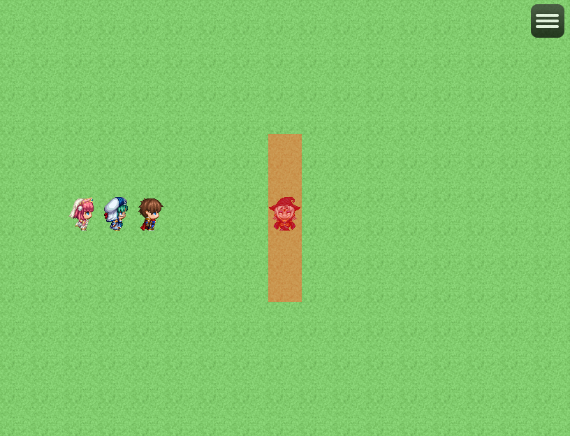
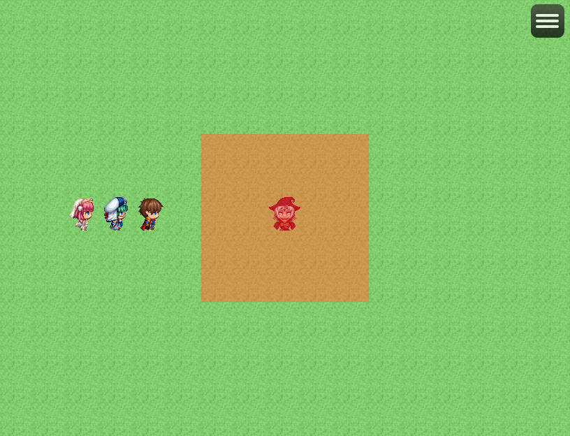
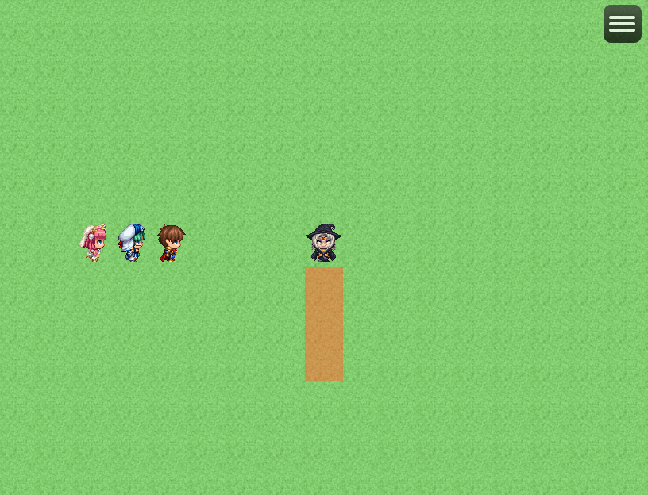
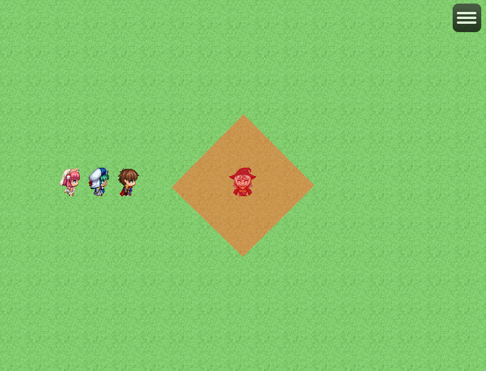

# シンボルエンカウント
## Ver.1.3.5
#### 必須、前提プラグイン
v114からNUUN_Baseが必須プラグインではなくなりました。  
[販売先](https://booth.pm/ja/items/7504032)  

シンボルエンカウントシステムを実装します。  
## 設定
イベントのメモ欄  
`<SymbolEncEnemy:[id]>` このタグがあるイベントはシンボルエンカウントとなります。  
`[id]`:シンボルエンカウント設定IDまたは識別名  

`<NotAnObstacleEvent>` イベントのプライオリティが通常キャラと同じに設定している場合、このタグが記入してあるイベントは障害物として認識されません。  

### イベントの各ページ設定
探索:自律移動指定可能、トリガー発動時のみイベント実行可能  
発見時:即イベント実行可能  
追跡:自律移動カスタム指定可能、トリガー発動時のみイベント実行可能  
退避:自律移動カスタム指定可能、トリガー発動時のみイベント実行可能  
イベント実行(旧戦闘):即イベント実行可能  
見失う:即イベント実行可能  
勝利:即イベント実行可能  
逃走成功:即イベント実行可能  
所定位置に戻る:自律移動カスタム指定可能、トリガー発動時のみイベント実行可能  
敗北:即イベント実行可能  

状態の移行は自動で行われますが、プラグインコマンドで指定の状態に移行できます。  
またシンボルエンカウント用のページ以外のイベントページの条件が一致している場合は、シンボルエンカウントとして認識されず通常のイベントとして実行されます。(Ver.1.0.1以降)  

### シンボルエンカウントの設定
プラグインパラメータのシンボルエンカウント設定でシンボルエンカウンターの設定を行います。  
   

#### 追跡中セーブ許可スイッチID
指定したスイッチが1以上に設定しOFFの間、追跡中にセーブが行えません。スイッチIDが0の場合は追跡時でもセーブ可能です。  

#### 探索経路限界値
探索経路の最大値を指定します。  

#### 識別名
識別名は任意の名称を記入します。シンボルエンカウント設定ID指定に使用します。  

#### 勝利後シンボルエンカウンター処理
消滅:勝利後シンボルエンカウンターが消滅します。この消滅の場合プラグインコマンド「シンボルエンカウンター復活」でエンカウンターの再表示が可能です。  
イベントの消滅:勝利後シンボルエンカウンターが消滅します。プラグインコマンド「シンボルエンカウンター復活」でエンカウンターの再表示は行われません。マップ再進入時に復活します。  
カスタム:勝利ページの実行内容にユーザ独自に処理を設定します。  

#### 特定スイッチシンボルエンカウント有効化
特定のスイッチがシンボルな場合にエンカウンターとして実行します。OFF時に通常のイベントとして実行する場合はシンボルエンカウント用のページ以外に処理を記入します。  
ON時はシンボルエンカウント用のページ設定のみ条件判定されます。OFF時は通常のページ条件のみ判定されます。  

#### 全同一画像有効
シンボルエンカウントページの画像を１ページ目の画像で表示します。シンボルエンカウントページ以外は適用されません。  

#### トリガー自動設定
シンボルエンカウントページのトリガーを自動設定します。   
1:探索(イベントから接触)  
2:発見時(並列実行)  
3:追跡(イベントから接触)  
4:退避(イベントから接触)  
5:イベント実行(旧戦闘)(自動実行)  
6:見失う(並列実行)  
7:勝利(並列実行)  
8:逃走成功(並列実行)  
9:所定位置に戻る(イベントから接触)  
10:敗北(並列実行)  

#### 探索モード
探索しない:プレイヤーが視界に入っても検知を行いません。またトリガー時はプレイヤーの方向を向きます(通常の処理)。接触時にイベント実行(戦闘)モードに移行します。    
探索する:プレイヤーを検知した場合、発見モードに移行します。トリガー時にプレイヤーの方向を向かず接触時に自動では状態移行は行いません。  

####  視認範囲の指定
##### circle
敵の認識範囲が円形になります。  
視認範囲範囲設定[接触範囲, 角度0°～360°]  
  
角度はイベントの正面からみた角度です。  
90°ならプレイヤー正面から左右45°  
  

##### triangle
敵の認識範囲が三角形になります。  
視認範囲範囲設定[正面からの接触範囲, 角度0°～180°]  
  

#### besideRange
指定した横方向の範囲内の接触判定を拡大します。向きは無視されます。  
視認範囲範囲設定[接触左側範囲(正の数の整数), 接触右側範囲(正の数の整数)]  
  

##### verticalRange
指定した縦方向の範囲内の接触判定を拡大します。向きは無視されます。  
視認範囲範囲設定[接触上側範囲(正の数の整数), 接触下側範囲(正の数の整数)]  
  

##### range
指定した範囲を中心に接触判定を拡大します。4と記入した場合はイベントを中心に±2マスの範囲(5マス)でトリガーが起動します。  
視認範囲範囲設定[接触横範囲(偶数の正の数の整数), 接触縦範囲(偶数の正の数の整数)]  
  

##### frontRange
指定したイベントからの真正面の範囲までの接触判定を拡大します。  
視認範囲範囲設定[接触範囲(正の数の整数)]  
  

##### rangeEX
イベントから指定した範囲内の接触判定を拡大します。  
視認範囲範囲設定[イベントの接触範囲点AX座標(整数),接触範囲点AY座標(整数),接触範囲点BX座標(整数),接触範囲点BY座標(整数),接触範囲点CX座標(整数),接触範囲点CY座標(整数),接触範囲点DX座標(整数),接触範囲点DY座標(整数)]  
接触判定をひし形にする。  
例:`<EventRange:rangeEX,0,-2,2,0,0,2,-2,0>`  
  

#### 反応モード
通常:範囲内のプレイヤーを検知します。  
無反応:範囲内にプレイヤーが侵入しても検知しません。  
ダッシュ時反応:ダッシュ時に範囲内のプレイヤーを検知します。 
移動時反応:移動時に範囲内のプレイヤーを検知します。 

#### プレイヤー探索範囲
プレイヤーがシンボルエンカウンターからの探索範囲を指定します。0で無制限になります。
指定の数値以上の距離が開いている場合は探索処理をスキップします。  

#### 移行モード
検知後移行するモードを指定します。  
追跡:プレイヤーを追いかけます。  
プレイヤーに近づく(プレイヤー固定):プレイヤーに向かって動き始めBattleモードに状態移行します。、その際にプレイヤーは動けなくなります。  
戦闘:Battleモードに状態移行します。  
なんとなく逃げる:プレイヤーから逃げげますが、、障害物に引っ掛かりやすいです。  
逃げる:プレイヤーから逃げげます。 
必死に逃げる:障害物をなるべく避けプレイヤーから逃げます。  

#### 追跡時スピード
プレイヤーを追跡するときの速度を指定します。イベント設定の最大値を超えて設定可能です。0でイベントページの設定になります。  

#### 逃走時時スピード
プレイヤーから逃げるときの速度を指定します。イベント設定の最大値を超えて設定可能です。0でイベントページの設定になります。  

#### 先制不意打ち有効
このシンボルの先制不意打ち有効を有効にします。なお、プラグインパラメータ「先制不意打ち格納変数」の値を1以上に設定してください。  

#### フォロワーすり抜け無効 Ver.1.1.3以降
この設定はプラグインパラメータ「フォロワーすり抜け」をONに設定している場合のみ有効になります。  
このシンボルタイプはフォロワーすり抜けが無効になります。  
フォロワーすり抜けは条件適用ページが通常のイベントの時には実行されません。  

#### 特殊移動
イベントの自立移動をカスタムに設定。  
ルートのスクリプトに記入。  
`this.junpPlayerPosition([最大移動幅])` プレイヤー横にジャンプして移動します。  
[最大移動幅]:最大のジャンプ幅  
`this.junpPlayerPosition(6)` 最大のジャンプ幅が6マスになります。  

### シンボルエンカウントの視認率
パーティ能力のエンカウント率無効が有効の場合、シンボルエンカウンターから認識されなくなります。  
エンカウント率半減が有効の場合、シンボルエンカウンターからの視認範囲が半分になります。  
なおどちらも「視認率変動なし」を有効にしているエンカウンターには効果はありません。  
茂み視認率は茂み属性のあるタイルを通行している場合にシンボルエンカウンターの視認範囲が視認率分現象します。  
視認率効果タグを設定しており、該当の視認率を変動させる効果のパーティが存在する場合は、一番有効な値が適用されます。  
特徴のメモ欄(Ver1.3.0追加)  
`<EncounterSightRate:[mathod]>` このタグがある特徴が戦闘パーティに存在する場合、エンカウンターの視認率を低下させます。  
`[mathod]`:任意のメソッド名はたは視認率設定のリストID  
例:  
視認率設定のリスト1番目の設定でメソッド名がbandit、視認率が30  
`<EncounterSightRate:bandit>` + エンカウント率半減  
視認率効果タグでbanditを指定しているエンカウンターの視認率は30％低下します。エンカウント半減は視認率50%なので一番低い30%が適用されます。  
視認率効果タグでbanditを指定していない場合は、視認率は50％低下します。50%はエンカウント半減の割合です。  
複数の設定が確認された場合は、一番有効な値が適用されます。この効果はパーティ能力になります。  

### 先制不意打ち
プラグインパラメータの「先制不意打ち格納変数」を1以上に設定することで有効になります。  
またエンカウントタイプ毎に先制不意打ちの有無を設定できます。  
イベント実行(旧戦闘)のイベントコマンドの「戦闘の処理」の前に「先制不意打ち格納変数」の変数に指定の値を代入することで先制攻撃または不意打ち攻撃を強制させることが出来ます。  
`0:通常 1:先制攻撃 2:不意打ち攻撃`  
また先制、不意打ち時のSE、BGMを設定できます。  
※戦闘の処理を実行しないと先制不意打ちのデータは初期化されませんので戦闘を行わない場合は、対象のエンカウントタイプの「先制不意打ち有効」をOFFに設定してください。 

### イベントの障害物設定 Ver.1.1.5で実装
イベントのプライオリティが通常キャラと同じに設定してある場合、障害物として視界を遮ります。  
イベントのメモ欄  
`NotAnObstacleEvent` このイベントは障害物として判定されません。  

## プラグインコマンド
### シンボルエンカウンター発見モード変更
対象のシンボルエンカウンターを発見モードに移行します。追跡、逃走はプラグインパラメータの設定に依存します。  
-1でそのマップ内全てのシンボルエンカウンターが対象。  

### シンボルエンカウンター追跡モード変更
対象のシンボルエンカウンターを追跡モードに移行します。プラグインパラメータの設定にかかわらず追跡範囲内なら追跡を開始します。    
-1でそのマップ内全てのシンボルエンカウンターが対象。  

### エンカウントタイプ変更
対象のシンボルエンカウンターを別のIDのタイプに変更します。  
-1でそのマップ内全てのシンボルエンカウンターが対象。  

### プレイヤー探知の強制
対象のシンボルエンカウンターを検知モードに移行します。プラグインパラメータの設定範囲とは別に検知します。  
-1でそのマップ内全てのシンボルエンカウンターが対象。  

### 今後のアップデート予定  
リージョン、地形タグでの視界突破  
ステートでの認識  

既知の不具合  

### 設定例
#### 敵に見つかったら追跡される処理を行いたい

#### アイテムを盗むところを住人に見つかって追跡される処理を行いたい

#### ジャンプ移動を行いたい
探索、追跡、退避、所定位置に戻るモードのページで、自律移動タイプをカスタム設定します。  
ルートのスクリプトに`this.junpPlayerPosition([移動距離])`を記入します。  
[移動距離]:イベントからのプレイヤーまでの移動距離。プレイヤーに届かない場合は一番近い位置にジャンプします。  
`this.junpPlayerPosition(10)`最大10マスジャンプして移動します。  

#### ワープ移動を行いたい
探索、追跡、退避、所定位置に戻るモードのページで、自律移動タイプをカスタム設定します。  
ルートのスクリプトに`this.teleportMovement([移動距離], [アニメーションID])`を記入します。  
[移動距離]:イベントからのプレイヤーまでの移動距離。プレイヤーに届かない場合は一番近い位置にワープします。  
[アニメーションID]:ワープ時に再生するアニメーションID。  
`this.teleportMovement(10,101)`最大10マスワープして移動し、ID101番のアニメーションが再生されます。  
例  
ウェイト：60フレーム  
スクリプト：this.teleportMovement(10,101)  

#### MOG_DizzyEffectと併用してプレイヤー発見時にエフェクトを発生させたい
イベントの発見モードのページで、MOG_DizzyEffectのプラグインコマンド「Setup」を実行します。  
イベントの戦闘、見失うモードのページでプラグインコマンド「Stop Dizzy」を実行します。  

#### シンボルエンカウントと接触後動作が出来なくなる。
シンボルエンカウントの戦闘の設定でランダムエンカウントと同じに設定している場合、マップの設定でエンカウントの設定を確認してください。  

### 範囲内戦闘参加シンボルエンカウント
Ver.1.0.2  
シンボルエンカウンターで戦闘を行った際に、周囲の他の追跡中のシンボルエンカウンターも戦闘に参加させるようにします。  
戦闘終了後に他の戦闘に参加したシンボルエンカウントイベントも同様に戦闘終了後の状態に移行します。  
プラグインコマンド逃走成功モード変更、勝利モード、敗北モードでの同期は行えません。  
敵グループ座標設定での設定が無い場合は、敵グループ座標設定内の設定によって座標がランダムに算出されます。  

ランダムに座標を設定しる場合、サイドビューバトルで表示させる場合は、出現範囲中心座標X、出現横範囲の設定値を変更する必要があります。  

#### 戦闘に参加する範囲
範囲内のシンボルエンカウントイベントが追跡モードなら戦闘に参加させます。範囲は接触したイベントから半径[戦闘に参加する範囲]内のシンボルエンカウントシンボルが戦闘参加対象になります。  
なお、戦闘参加除外IDで設定されているIDのシンボルエンカウントイベントは戦闘の参加から除外されます。  

#### 範囲戦闘無効スイッチ
スイッチを1以上に設定した場合に、スイッチがONの時は戦闘の参加を実行しないようにします。  
なお、このプラグインを導入している場合は常に戦範囲内の闘の参加を行います。  

### フィールドアタック
イベントへ攻撃アクションを行います。  
イベントに攻撃を行った場合、攻撃回数に応じて指定のセルフスイッチがONになります。  
NUUN_SymbolEncounterでのシンボルエンカウンターに攻撃した場合、先制攻撃としてバトルに状態移管します。  

### 更新履歴
2026/5/4 Ver.1.0.9  
特定のイベントに対してフィールドアタックを行えない機能を追加。  
2026/4/26 Ver.1.0.8  
武器の攻撃距離設定の設定値が適用されない問題を修正。  
2026/4/20 Ver.1.0.7  
フィールドアタックを無効にするスイッチを追加。  
2026/3/22 Ver.1.0.6  
ロード後にエラーが起こる問題を修正。  
2026/3/8 Ver.1.0.5  
シンボル名をpagedownに変更。  
スキップ戦闘でレベルアップ時に、NUUN_ResultEx(有償版)でのレベルアップ画面を表示する機能を追加。  
2026/2/28 Ver.1.0.4    
設定の無い武器タイプでフィールドアタックを行うとエラーが出る問題を修正。  
いくつかのスキルツリープラグインでのSP獲得に対応。  
2026/2/7 Ver.1.0.3  
シンボルエンカウンターに対してフィールドアタックを行った回数を格納する変数を設定する機能を追加。  
スキップ戦闘を行った回数を格納する変数を設定する機能を追加。  
スキップ戦闘を行った際に指定のセルフスイッチをONにする機能を追加。  
2026/1/29 Ver.1.0.2  
スキップ戦闘時の報酬の獲得設定を追加。  
2026/1/18 Ver.1.0.1  
シンボルエンカウンターを攻撃した際に、特定条件時に戦闘をスキップする機能を追加。  
2026/1/17 Ver.1.0.0  
初版  

## 更新履歴
2026/5/5 Ver.1.3.5  
シンボルエンカウンターがプレイヤーを見失い後、状態移行しない問題を修正。  
2026/5/4 Ver.1.3.4  
視認計算が想定の回数よりも多く計算されていた問題を修正。  
視認範囲の判定を修正。  
2026/5/2 Ver.1.3.2  
プレイヤー検知時に方向転換してしまう問題を修正。  
検知時に特定条件で追跡、逃走状態に移行しないように修正。  
2026/4/19 Ver.1.3.1  
タグでの視認率設定の仕様を変更。  
視認率設定の同一タグが存在する場合、最も有効な視認率が設定されない問題を修正。  
2026/4/12 Ver.1.3.0  
特定のタグで視認率を設定できる機能を追加。  
戦闘終了後に状態移行が行われない問題を修正。  
2026/4/6 Ver.1.2.6  
先制、不意打ちが機能していなかった問題を修正。  
2026/4/5 Ver.1.2.5  
所定位置に戻る際に、OverpassTile、NRP_OverpassTileでの立体交差をまたいで戻る場合に、特定の条件で移動を終了してしまう問題を修正。  
2026/4/4 Ver.1.2.4  
見失った際にシンボルエンカウンターの動作を停止する機能を追加。  
特定条件で戦闘開始時にエラーが表示される問題を修正。  
2026/3/29 Ver.1.2.3  
シンボルエンカウントタイプ変更を行った際に、状態移管が正常に変更されない問題を修正。  
2026/3/22 Ver.1.2.2  
シンボルエンカウントとのバトル時、敵グループが未設定の場合フリーズしてしまう問題を修正。  
2025/12/29 Ver.1.2.1  
プレイヤーが無敵状態時に硬直状態ではないシンボルエンカウンターと接触すると、バトルに状態移行してしまう問題を修正。  
2025/11/28 Ver.1.2.0  
プレイヤーを見失った際に、検知の範囲内にプレイヤーがいる場合、直ちに再検知してしまう問題を修正。  
プレイヤーを見失う、諦める直後の再検知を行わないフレーム数を指定できる機能を追加。  
障害物の前にプレイヤーが範囲内に入った場合でも、シンボルエンカウンターが認識しない問題を修正。  
イベントでプライオリティが通常キャラと同じに設定している場合でも障害物と判定されない問題を修正。  
イベントで障害物と判定されない機能を追加。  
2025/11/6 Ver.1.1.4  
NUUN_Baseなしで動作するように修正。  
2025/10/27 Ver.1.1.3  
ワープ移動処理を追加。  
シンボルエンカウント時の敵グループが未設定だった場合は勝利モードに移行するように修正。  
シンボルエンカウンターがフォロワーをすり抜ける機能を追加。  
2025/10/25 Ver.1.1.2  
マップ移動時に追跡中のスイッチがOFFにならない問題を修正。  
追跡中でのセーブの実行を許可するスイッチを追加。  
2025/10/24 Ver.1.1.1  
ランダムエンカウントの戦闘終了後に直前のシンボルエンカウントが実行されてしまう問題を修正。  
2025/10/22 Ver.1.1.0  
先制不意打ち時に戦闘BGMを変更できる機能を追加。  
プラグインコマンドにエンカウントタイプを変更する機能を追加。  
プラグインコマンドに検知の強制を追加。  
追跡時にONにするスイッチを追加。  
特定のスイッチがONの時に探索なしでもプレイヤーを検知させる機能を追加。  
2025/10/20 Ver.1.0.2  
プラグインコマンドでイベントを指定した場合、ID番号がずれて指定していた問題を修正。  
プラグインコマンドでイベントを指定した場合、シンボルエンカウンターではない場合にエラーが出る問題を修正。  
シンボルエンカウント設定のリストID2の識別名をrunからrunSymbolに変更。  
2025/10/19 Ver.1.0.1  
通常イベントページの条件が有効なら適用できるように修正。  
2025/10/18 Ver.1.0.0  
初版  
