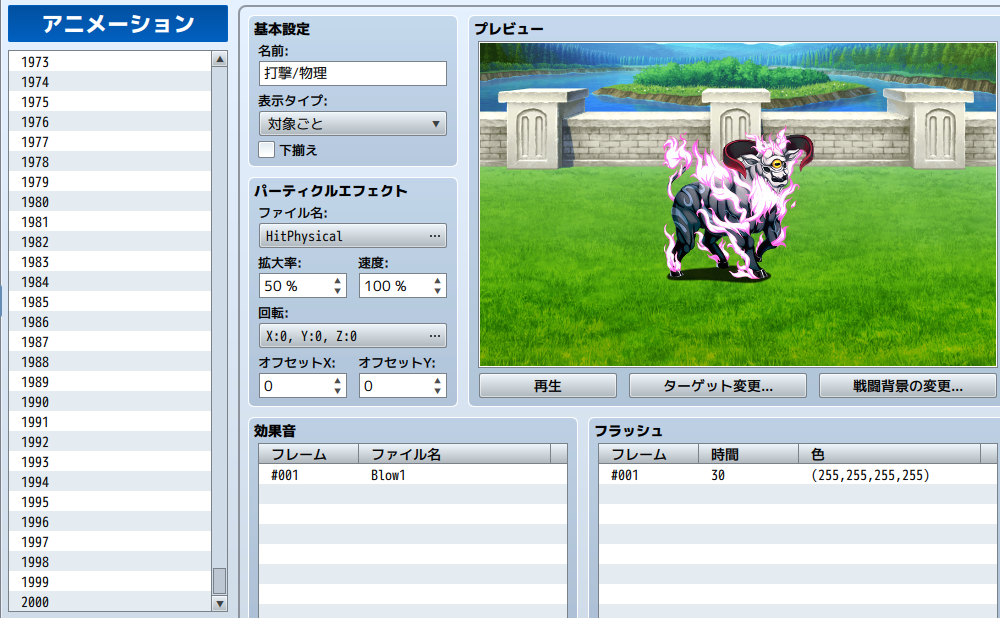
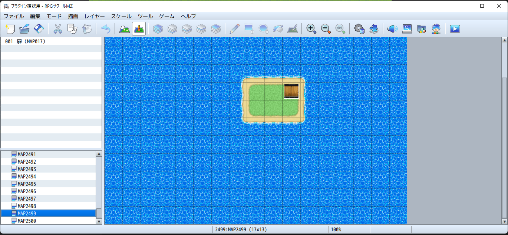

# [マップ、アニメーションデータベース上限突破](https://raw.githubusercontent.com/nuun888/MZ/master/NUUN_SystemDatabaseUnlimited.js)
# Ver.1.0.2
[ダウンロード](https://raw.githubusercontent.com/nuun888/MZ/master/NUUN_SystemDatabaseUnlimited.js)
#### 必須、前提プラグイン
[共通処理](https://github.com/nuun888/MZ/blob/master/README/Base.md)  

マップの上限数(デフォルト2000)、アニメーションの上限数(デフォルト1000)を超えて設定できるようになります。  
上限の変更を行うにはプラグインコマンドでテストプレイ中に実行します。  
実行前にバックアップをとることを推奨いたします。  

## 設定
プラグインコマンドでアニメーション最大値またはマップ最大値を選択します。  
テストプレイで上記のコマンドを実行します。  
データベースが増えたことを確認したらデータを保存します。  

  
  

アクター、職業、アイテム、武器、防具、ステート、敵キャラ、敵グループ、コモンイベントは設定できる上限が9999なので設定できるプラグインコマンドはありません。  

## 更新履歴 
2023/8/23 Ver.1.0.2  
マップ新規追加時にマップJSONファイルを出力するように修正。  
2023/1/21 Ver.1.0.1  
マップを制限なく追加できる機能を追加。  
2023/1/19 Ver.1.0.0  
初版。  
