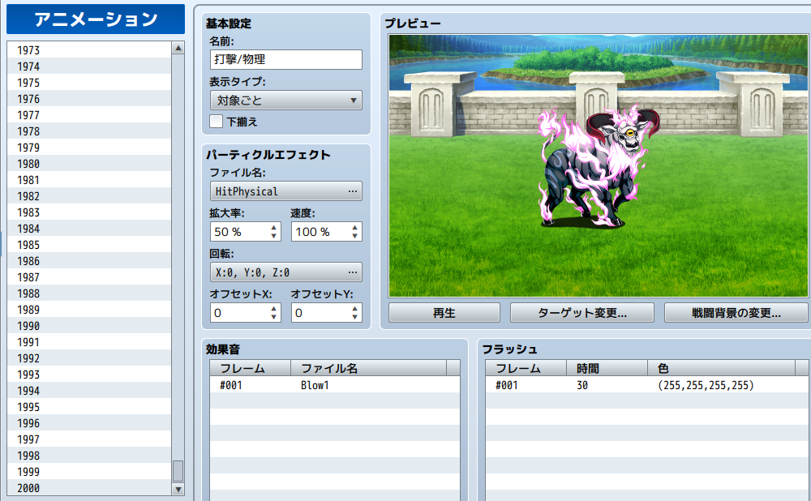
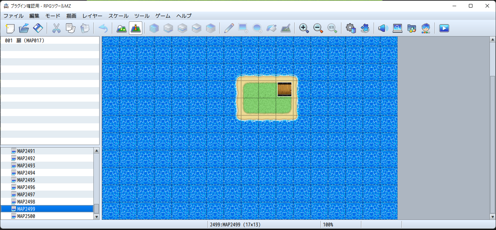

# [マップ、アニメーションデータベース上限突破](https://raw.githubusercontent.com/nuun888/MZ/master/NUUN_SystemDatabaseUnlimited.js)
# Ver.1.1.0
[ダウンロード](https://raw.githubusercontent.com/nuun888/MZ/master/NUUN_SystemDatabaseUnlimited.js)
#### 必須、前提プラグイン

RPGツクールMZのエディタは9999までデータが追加できる。  
しかしアニメーションは1000までしか設定できない。  
またマップも2000までしか追加できない。  
そのため、JSONファイルを直接編集して追加する方法しかなかった。  
このプラグインではJSONファイルを直接編集せずに、プラグインコマンドでデーターベースの最大値を超えて追加を行う。  
追加した設定はエディタ上で表示、編集が可能。  
  

## 設定
プラグインコマンドでアニメーション最大値またはマップ最大値を選択します。  
テストプレイで上記のコマンドを実行します。  
データベースが増えたことを確認したらデータを保存します。  

  
  

アクター、職業、アイテム、武器、防具、ステート、敵キャラ、敵グループ、コモンイベントは設定できる上限が9999なので設定できるプラグインコマンドはありません。  

## 更新履歴 
6/14/2026 Ver.1.1.0  
NUUN_Baseなしで実行できるように修正。  
2023/8/23 Ver.1.0.2  
マップ新規追加時にマップJSONファイルを出力するように修正。  
2023/1/21 Ver.1.0.1  
マップを制限なく追加できる機能を追加。  
2023/1/19 Ver.1.0.0  
初版。  
