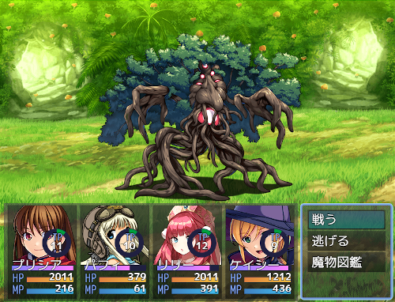

# [TP円形ゲージプラグイン](https://raw.githubusercontent.com/nuun888/MZ/master/NUUN_TpCircularGauge.js)
# Ver.1.1.1
[ダウンロード](https://raw.githubusercontent.com/nuun888/MZ/master/NUUN_TpCircularGauge.js)  

TPゲージを円形にします。  
バトルスタイル拡張プラグインと併用する場合はこのプラグインを「NUUN_BattleStyleEX_Base」より下に配置してください。  

  

## 画像の仕様
画像の中心を基準に弧を描くようにアニメーションします。  
ゲージ半径、ゲージ縦幅は画像のサイズで計算されます。  
画像はゲージ背景画像、ゲージ画像両方設定してください。  

## 更新履歴
2022/5/19 Ver.1.1.1  
ゲージ更新時に前の画像が残ってしまう問題を修正。  
2022/5/18 Ver.1.1.0  
画像対応。  
バトルスタイル拡張Ver.3.0.0以降で座標の変更ができなかった問題を修正。  
2021/5/3 Ver.1.0.4  
Y座標の変更が機能していなかった問題を修正。  
2021/5/2 Ver.1.0.3  
処理ミスがあったため修正。  
2021/5/1 Ver.1.0.2  
LL_ExGaugeDrawingの一部機能に対応。  
2021/4/27 Ver.1.0.1  
アクターステータスにのみ表示するように修正。  
2021/4/25 Ver.1.0.0  
初版  
