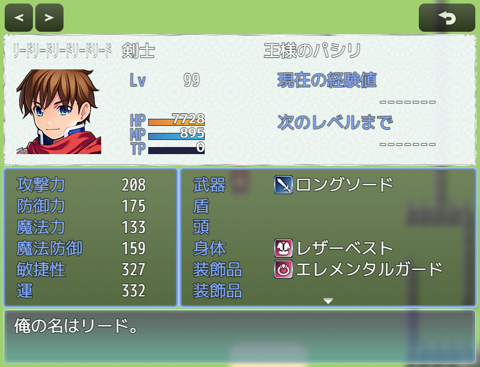

# [ウィンドウスキン個別設定](https://raw.githubusercontent.com/nuun888/MZ/master/NUUN_WindowSkinIndividual.js)
# Ver.1.0.3
[ダウンロード](https://raw.githubusercontent.com/nuun888/MZ/master/NUUN_WindowSkinIndividual.js)
#### 必須、前提プラグイン
[共通処理](https://github.com/nuun888/MZ/blob/master/README/Base.md)  

ウィンドウスキンをウィンドウ毎に設定できます。  

  

リストにないクラスは該当するクラスをテキストタブで直接記入してください。  
例:`Window_Base `

## 設定
2024/10/8 Ver.1.0.3  
セーブ画面を開くとエラーが出る問題を修正。  
2023/4/29 Ver.1.0.2  
ヘルプウィンドウを表示するシーンを表示する際に、エラーが出る問題を修正。  
2023/4/10 Ver.1.0.1  
識別名指定によるクラス指定の処理を追加。  
2022/6/15 Ver.1.0.0  
初版  
