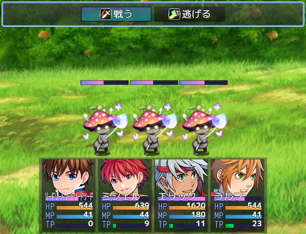

# [XP風バトルコマンド](https://raw.githubusercontent.com/nuun888/MZ/master/NUUN_XPBattleCommand.js)
# Ver.1.0.2

パーティコマンド、アクターコマンドをXP風に表示します。  

# プラグインパラメータ
### パーティコマンド中央寄り  
パーティコマンドの項目の表示を中央寄りに表示します。  

### 最大パーティコマンド列数  
表示する最大列数を指定します。  

### パーティコマンド表示位置  
パーティコマンドの表示位置を上、中央、アクターステータスの上に表示してます。  

### アクターコマンド可変表示  
アクターコマンドをウィンドウを可変表示にします。コマンド数が４なら４行、６なら６行で表示されます。

### 最大アクターコマンド行数  
表示する最大行数を指定します。 
