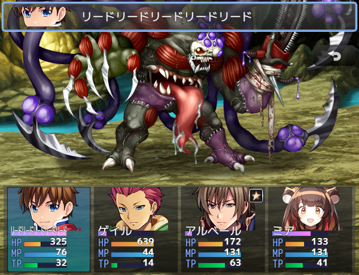
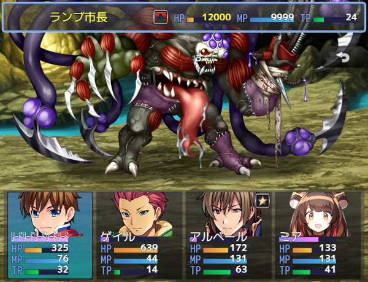
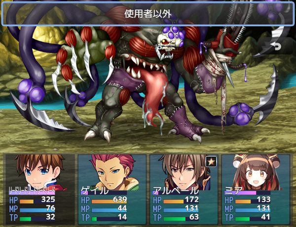

# [XP風対象選択ウィンドウ](https://raw.githubusercontent.com/nuun888/MZ/master/NUUN_XPSelectWindow.js)
# Ver.1.3.2
[ダウンロード](https://raw.githubusercontent.com/nuun888/MZ/master/NUUN_XPSelectWindow.js)  

## 必須、前提プラグイン
[共通処理](https://github.com/nuun888/MZ/blob/master/README/Base.md)  
[ステータス項目ベース](https://github.com/nuun888/MZ/blob/master/README/NUUN_MenuParamListBase.md)  

敵、味方の対象選択時のウィンドウをXP風に変更します。  
対象選択時に名前、顔グラ、ステート、HP、MP、TPを表示できます。  

  
  

#### ※画像はバトルスタイル拡張プラグインを使用していますが、単体でも動作いたします。  

全体、ランダム、敵味方全体攻撃(Ver.1.6.1以降)でも対象選択と併用することで、全体、ランダム対象時の表示をすることができます。
  

## 更新履歴
2025/5/10 Ver.1.3.2  
ゲージ表示を行っている場合にエラーが出る問題を修正。  
2025/2/2 Ver.1.3.1  
敵のウィンドウの透明度が適用されていなかった問題を修正。  
ウィンドウ開閉時のアニメーションの有効無効化する機能を追加。  
2025/1/4 Ver.1.3.0  
背景画像を表示する機能を追加。  
2024/12/17 Ver.1.2.1  
対象選択時にエラーが出る問題を修正。  
2024/9/8 Ver.1.2.0  
ステータス項目ベースプラグインを介しての処理に仕様変更。  
幾つかのプラグインパラメータのスペルミスを修正。  
2023/1/10 Ver.1.1.4  
対象選択画面表示位置が上部しか適用されていなかった問題を修正。  
2023/1/9 Ver.1.1.3  
アクター及び敵キャラのウィンドウを表示しない設定にしたときエラーが出る問題を修正。  
対象選択ウィンドウが表示されない問題を修正。  
2022/9/4 Ver.1.1.2  
特定の場面でウィンドウが表示さてたままになってしまう問題を修正。  
2022/8/26 Ver.1.1.1  
スクロール時のSEを再生しない機能を追加。  
アクターコマンドを開くと対象選択時のカーソルSEが再生しまう問題を修正。  
2022/8/24 Ver.1.1.0  
敵対象選択時にスクロール選択出来る機能を追加。  
2022/6/5 Ver.1.0.5  
微修正。  
2022/4/2 Ver.1.0.4  
敵に顔グラを指定できる機能を追加。  
2022/4/1 Ver.1.0.3  
評価式のバトラーの取得する変数を変更。  
2022/3/31 Ver.1.0.2  
敵のデフォルトのステート表示が表示されないように修正。  
2022/3/30 Ver.1.0.1
敵の対象選択時にアクターステータスウィンドウを表示するように修正。  
アクター選択時の顔グラの表示を立ち絵、顔グラ表示EX設定に対応。  
2022/3/27 Ver.1.0.0  
初版  
