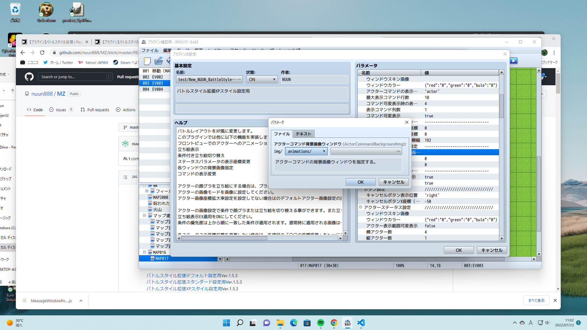

## よくある質問
Q:バトルスタイル拡張プラグインとルルの教会様の「戦闘立ち絵表示」プラグインと併用すると立ち絵がバトルステータスの前に表示される。  
A:プリラグインリストでバトルスタイル拡張プラグインを戦闘立ち絵表示プラグインより後に配置してください。  

Q:右を項目を未指定にするとエラーが表示される。  
   
A:背景画像を指定するには２つ設定する項目がありますが、左はimgフォルダ直下のフォルダを指定、右は画像ファイルを指定するようになっています。なのでフォルダと画像ファイルを指定する必要があります。
imgフォルダの指定はなしが選択できないので、画像指定しない場合は空白にしてください。 

Q:メモ欄に設定した設定値が適用されない。  
A:[]ごと、数値、文字列を代入してください。例`<xxx:[x]>` → `<xxx:20>`  
一部のプラグインで設定値の前にスペースを入れると適用されない場合があります。  

Q:設定した文字列または、評価式が適用されない。  
Comboボックス形式での入力は"または'で囲ってください。  
